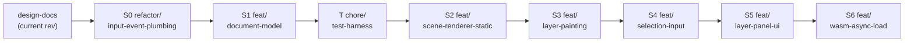

# Multi-Artboard — Implementation Order

Companion to [`multi-artboard.md`](./multi-artboard.md). That document is the _design_; this one is the _build order_. It slices the design into a linear stack of stages where **each stage leaves the tree in a state you can test on its own**, and each stage lands in **one jj revision with a named bookmark**.

Section references (§) point back into `multi-artboard.md`.

## Start here (handoff)

If you are picking this up cold, read this section first.

### Progress checklist

Implement each of the following steps in their own jj-vcs bookmarks, build subsections as jj-revisions, and move the bookmark up the stack as needed. Goal is to have proper checkpoints in case things need to be reverted. 
Check a box off only when that stage's independent test passes **and** its jj bookmark is created. Stages are strictly ordered top-to-bottom.

- [x] **S0** — `refactor/input-event-plumbing` — behavior-preserving refactors
- [x] **S1** — `feat/document-model` — serde document + loader + assets
- [x] **T** — `chore/test-harness` — headless GPU + readback + fixtures + event capture
- [ ] **S2** — `feat/scene-renderer-static` — world-px camera + quad compositor (no painting)
- [ ] **S3** — `feat/layer-painting` — stroke→layer targeting + ping-pong-free merge
- [ ] **S4** — `feat/selection-input` — selection stack + bubble dispatch + move
- [ ] **S5** — `feat/layer-panel-ui` — egui artboard/layer panel + CRUD
- [ ] **S6** — `feat/wasm-async-load` — wasm fetch path + full verification

**Use this list as you work.** At the start of a session, mirror the unchecked stages into your task tracker (the TodoWrite / task tool) and mark exactly one stage `in_progress` at a time. When a stage's test passes and its bookmark lands, tick its box **in this doc** (so the checked state survives across chats — the task tracker does not) and mark the task completed. Do not start the next stage until the current box is checked.

- **Read both docs, design first.** [`multi-artboard.md`](./multi-artboard.md) is the design (structs, shaders, coordinate spaces, risks); this doc is the build order. Neither is standalone.
- **Nothing is implemented yet.** As planned, all three docs (the two here + the feature design) sit **uncommitted in jj revision `2b45e9e` "multi-artboard support"**, with no implementation code written. Run `jj status` / `jj log` to confirm where the tree actually is before starting — begin at stage **S0**.
- **Line-number references are hints, not coordinates.** Citations like `app.rs:260` or `canvas_state.rs:459-504` will drift as the stages rewrite those files. They are anchored by symbol/function names too — relocate by the name, not the number.
- **API-level pseudocode is illustrative.** Signatures for wgpu 27, egui 0.33, and the `thumbhash` crate are sketches to convey intent; verify them against the real crate APIs as you implement rather than pasting verbatim.
- **`README.md` is pre-plan.** Its architecture diagram still shows a single `CanvasContext`; this plan supersedes it. Don't build a mental model from the README.

### Build / test / run commands

| Purpose                    | Command                                       | Notes                                                                     |
| -------------------------- | --------------------------------------------- | ------------------------------------------------------------------------- |
| Native run                 | `cargo run`                                   | Add the `--doc <name>` dev flag once revision `T` lands (§ Test tooling)  |
| Unit tests                 | `cargo test -p crayon --lib -p batteries`     | Keep green at every stage boundary                                        |
| Lint                       | `cargo clippy`                                | Repo convention; part of each stage's exit criteria                       |
| Native build               | `cargo build`                                 |                                                                           |
| wasm build (compile check) | `cargo build --target wasm32-unknown-unknown` | Fast gate; keep green every stage                                         |
| wasm bundle                | `./build.sh`                                  | Runs `wasm-pack build crayon --target bundler --out-dir ../../www/crayon` |

**wasm serving is not reproducible from this repo.** `./build.sh` emits the bundle into `../../www/crayon` — an **external** project outside this repository that hosts the `<canvas id="canvas">` page. The S6 web verification (placeholder→content swap, WebGL-limit checks) requires that separate `www` project to serve the bundle; an agent with only this repo can compile-check wasm (`cargo build --target wasm32-...`) but cannot run the S6 manual web pass here. Flag this to the user when you reach S6.

## Principles

- **One stage = one jj revision = one bookmark.** Revisions are stacked linearly on top of the current design-docs revision.
- **Every stage is independently verifiable** before the next begins — by unit tests, by a behavior-preserving regression pass, or by a specific manual check described in the stage. A stage is not "done" until its own test passes.
- **The build never breaks.** `cargo build` (native + `wasm32-unknown-unknown`) and `cargo test` stay green at every stage boundary. The one _runtime_ regression window (painting temporarily off) is confined to S2→S3 and called out explicitly.
- **Bottom-up dependency order.** Data model → renderer → input → UI. Nothing depends on a stage above it.

## Stage → bookmark map

| Stage | Bookmark                        | Builds                                                                 | Independent test                                          |
| ----- | ------------------------------- | ---------------------------------------------------------------------- | --------------------------------------------------------- |
| S0    | `refactor/input-event-plumbing` | Behavior-preserving refactors (§ Step 0)                               | Regression: app identical, tests green                    |
| S1    | `feat/document-model`           | serde document + loader + assets (§1)                                  | Unit tests only; app unchanged                            |
| T     | `chore/test-harness`            | headless GPU + readback + fixtures + event capture (§ Test tooling)    | Self-test: renders a fixture doc offscreen, probes pixels |
| S2    | `feat/scene-renderer-static`    | world-px camera + quad compositor + SceneRenderer (§2.1–2.4, §2.7)     | Load & navigate multi-artboard docs; **no painting yet**  |
| S3    | `feat/layer-painting`           | stroke→layer targeting + ping-pong-free merge (§2.5, §2.6, §2.8)       | Draw on a hardcoded-target layer; strokes merge           |
| S4    | `feat/selection-input`          | selection stack + bubble dispatch + move (§3)                          | Click-select, draw selected layer, cmd+drag move/pan      |
| S5    | `feat/layer-panel-ui`           | egui artboard/layer panel + CRUD (§4)                                  | Full create/delete/visibility via panel                   |
| S6    | `feat/wasm-async-load`          | wasm `DocumentLoaded` fetch path (§1.7, §1.8) + full verification (§7) | Web: thumbhash placeholder → real content                 |



## jj workflow

The current revision (`2b45e9e multi-artboard support`) now holds the two design docs, so it is no longer empty — start each stage with `jj new` (not `jj describe`). Per stage:

```sh
# 1. start the stage stacked on top of the previous one
jj new -m "S0: refactor input + event plumbing (behavior-preserving)"

# 2. ...implement... (jj auto-snapshots the working copy; no `git add`)

# 3. run the stage's independent test (below). Only once it passes:
jj bookmark create refactor/input-event-plumbing   # bookmark points at @

# 4. begin the next stage on top
jj new -m "S1: document model"
```

Notes:

- Bookmarks are created at the **tip** of each stage so `jj log` reads as a labeled ladder. If you keep amending after bookmarking, move it forward with `jj bookmark set <name> -r @`.
- Keep stages append-only. If review of an earlier stage requires a fix, prefer `jj new` on top or `jj squash` into that stage's revision rather than reordering.
- Run `jj status` before starting a stage to confirm the working copy is clean and you are where you expect.

---

# Test tooling (revision `T`, built after S1)

The design doc calls manual GPU checks "unavoidable" for the renderer stages. They aren't — the codebase is already most of the way to automatable renderer tests, and a small harness closes the gap. Build it as its own revision `T` between S1 and S2 (the in-code document builders can also be pulled forward into S1, since S1's unit tests benefit from them). Everything here is `#[cfg(test)]` / test-only; none of it ships in the app binary.

## The one enabler: a headless GPU harness

Two facts from the current code make this cheap:

- wgpu will return a `device`/`queue` from an adapter requested with `compatible_surface: None` — no window, no surface. `RenderContext::new` (`render_context.rs:18`) only couples to a window because it also configures a `Surface`; a test path skips that.
- `CRTexture::create_render_texture` (`texture.rs:29-32`) already requests `COPY_SRC` usage, so **every render texture is readable back today** via `copy_texture_to_buffer` — no production change needed to inspect rendered output.

New module `crayon/src/testing/gpu.rs` (or `tests/support/`):

```rust
/// Headless device+queue. Use downlevel_webgl2_defaults() so tests fail on the
/// SAME capability ceiling as WebGL (2048 max texture dim, 4 bind groups) rather
/// than passing on a permissive native adapter and breaking only on web.
pub fn headless_gpu() -> (wgpu::Device, wgpu::Queue) {
    let instance = wgpu::Instance::new(&Default::default());
    let adapter = pollster::block_on(instance.request_adapter(&wgpu::RequestAdapterOptions {
        power_preference: wgpu::PowerPreference::default(),
        compatible_surface: None,          // <- the whole trick
        force_fallback_adapter: false,
    })).expect("no adapter");
    pollster::block_on(adapter.request_device(&wgpu::DeviceDescriptor {
        required_limits: wgpu::Limits::downlevel_webgl2_defaults(),
        ..Default::default()
    })).expect("no device")
}

/// Map a render texture back to CPU RGBA8. Handles the 256-byte bytes-per-row
/// alignment wgpu requires, then strips padding.
pub fn readback_rgba(dev: &wgpu::Device, q: &wgpu::Queue,
                     tex: &wgpu::Texture, (w, h): (u32, u32)) -> Vec<u8> { /* copy → map → block_on */ }
```

**One design decision this forces on S2 (call it out there):** the scene pass must render to an _injectable_ `&wgpu::TextureView` — the surface view in production, an offscreen `CRTexture` view in tests. If `CanvasRenderSystem` reaches for the surface internally, it can't be driven headless. This is a signature choice, not extra code.

## Light helpers on top

```rust
// crayon/src/testing/fixtures.rs — construct documents + pixels in code, no PNG assets on disk.
pub fn doc_single_layer() -> Document;                       // reuse Document::default_document()
pub fn doc_two_artboards() -> Document;                      // distinct world positions, for placement tests
pub fn solid_layer_pixels(size: (u32,u32), rgba: [u8;4]) -> Vec<u8>;  // premultiplied fill

// crayon/src/testing/probe.rs — coarse spatial assertions without golden images.
pub fn sample(pixels: &[u8], size: (u32,u32), x: u32, y: u32) -> [u8;4];
pub fn assert_pixel(pixels: &[u8], size: (u32,u32), x: u32, y: u32, expect: [u8;4], tol: u8);

// crayon/src/testing/events.rs — capture emitted ControllerEvents for input tests (no GPU).
pub struct CapturingSender { pub events: Rc<RefCell<Vec<ControllerEvent>>> }
// or just hold the native mpsc Receiver end and drain it after feeding synthetic input.
```

**Why pixel probes instead of golden images.** Probing a handful of known coordinates ("artboard-2 center is red, the gap between artboards is clear-color") is immune to the sub-pixel and driver-level nondeterminism that makes golden-PNG diffs flaky, and it needs zero reference-image storage or an `UPDATE_GOLDEN` regeneration flow. It covers spatial-placement and compositing checks through S5. **Defer golden images** until a stage has output whose _shape_ a probe can't pin down (e.g. verifying a stroke's silhouette) — add them then, scoped, not now.

## What each stage gets from the harness

| Piece                                                  | Unblocks                  | How                                                                                                            |
| ------------------------------------------------------ | ------------------------- | -------------------------------------------------------------------------------------------------------------- |
| `headless_gpu` + `readback_rgba` + injectable target   | S2, S3                    | Render a fixture doc offscreen, read it back, assert                                                           |
| Document builders / `solid_layer_pixels`               | S1–S6                     | No hand-made PNG assets; deterministic inputs                                                                  |
| Pixel probes                                           | S2, S3                    | "Artboards at correct world px; visibility respected; off-screen culled"; "stroke merged into the right layer" |
| Event capture                                          | S4                        | "cmd+drag + layer selected → `MoveLayer`; none → camera pan; zoom always reaches Global"                       |
| `--doc <name>` dev flag (`lib.rs`/`main.rs`, ~5 lines) | manual checks, all stages | Launch against any `assets/documents/*.json` without recompiling                                               |

**Independent test for revision `T` itself:** a smoke test that builds `headless_gpu()`, renders `doc_single_layer()` to a small offscreen target through the (S2-shape) scene path, reads it back, and probes that the background is the clear-color. This proves the harness works before S2 relies on it. (If `T` lands before S2's renderer exists, the smoke test can instead render a trivial single-quad pass to validate `headless_gpu` + `readback_rgba` end-to-end, then graduate to the real scene path in S2.)

Net effect on the plan: **S2–S4 become `cargo test`-automatable**; only final visual/UX polish (S5 panel feel, S6 web) stays genuinely manual.

---

# S0 — `refactor/input-event-plumbing`

**Builds** (§ "Migration steps" Step 0): purely behavior-preserving groundwork so later diffs stay small.

- `event_sender.rs`: add `impl From<ControllerEvent> for CustomEvent`; collapse both hand-written relay matches (native mpsc thread + wasm) to `proxy.send_event(event.into())`.
- `resources/input_system.rs`: track modifier state via `WindowEvent::ModifiersChanged`; delete the `SuperLeft`/`SuperRight` key tracking in `brush_controller.rs` (`is_disabled`) and `camera_controller.rs` (`is_super_pressed`), reading the shared modifier state instead.

**Depends on:** nothing.

**Independent test — regression, no new behavior:**

- `cargo test -p crayon --lib -p batteries` green.
- `cargo build && cargo build --target wasm32-unknown-unknown` both clean.
- `cargo run`: draw a stroke; cmd+drag pans; cmd+scroll zooms; cmd+R clears; Esc exits — **every shortcut behaves exactly as before this stage.** This is the whole acceptance bar: identical UX, smaller surface.

**Done when:** regression pass is clean and the `From` impl is the single source of the event relay.

---

# S1 — `feat/document-model`

**Builds** (§1): the pure-data document layer, fully unit-tested, **not yet wired to rendering**.

- Deps (§1.4): `serde`, `serde_json`, `image` (png), `thumbhash`, `base64`.
- `document/mod.rs`: `Document`, `Artboard`, `Layer`, `ArtboardId`, `LayerId` + methods (`default_document`, `alloc_*_id`, `artboard[_mut]`, `find_layer`, `hit_test`).
- `document/loader.rs`: native `load_document` (JSON parse → decode PNGs → crop/pad to artboard-sized premultiplied RGBA8 → `LoadedDocument`); wasm signature present but may be a `todo!()` stub (wired in S6).
- Thumbhash helpers (§1.6): `generate_thumbhash`, `thumbhash_preview`.
- Assets: `assets/documents/default.json`, one hand-made `default.layer-2.png`, and `two-boards.json` (multi-artboard, for S2+).

**Depends on:** S0.

**Independent test — unit tests + asset-load test, app unchanged:**

- New tests in `cargo test`: serde round-trip (`Document` → JSON → `Document` equality); `hit_test` (overlapping artboards → topmost/reverse-draw-order wins; miss → `None`); `default_document` shape; id allocation monotonicity; thumbhash encode→decode round-trip; `load_document("default")` yields per-layer buffers sized exactly `w*h*4` and premultiplied.
- `cargo run` is **byte-for-byte the same app** — the module compiles but nothing constructs it yet. This isolation is the point: the data model is provable before any GPU code touches it.

**Done when:** all document tests pass and `load_document` reads the committed assets on native.

---

# S2 — `feat/scene-renderer-static`

**Builds** (§2.1–2.4, §2.7, §2.2): the renderer swap and world-px camera — **rendering only, no painting.** This is the largest stage; it replaces the monolithic canvas with the general compositor and is the reason the camera rework lands here (the old fullscreen-quad canvas has no world extent, so the two cannot be cleanly separated).

- `renderer/camera.rs`: world-px semantics — `world_to_clip_matrix`, `screen_to_world`, `visible_world_rect`, `translation` = viewport-center world point, `DEFAULT_CANVAS_ZOOM → 1.0`; retire `build_2d_[inverse_]transform_matrix`, `aspect_ratio` scaling, `adjust_scale_for_resize`, `DISPLAY_VERTICES`. Update `constants.rs`.
- `renderer/shaders/quad.wgsl` + `QuadInstance` (§2.4).
- `resources/scene_renderer.rs`: `SceneRenderer` — construction, `hydrate`, `create_layer`/`destroy_layer`/`clear_layer`, layer textures + bind groups, `white_texture`, quad pipeline, camera buffer, `upload_quads`. (`stroke_scratch`/`merge_scratch`/`accumulate_*`/`merge_*` may be present but unused until S3.)
- `resources/document_state.rs`: `DocumentState { document, selection, gpu_dirty }` + `GpuOp`; apply create/destroy/clear.
- `systems/canvas_render_system.rs`: rewrite as the quad-list builder + scissor-clipped scene pass (§2.7). **Render to an injectable `&TextureView`** (surface view in prod, offscreen texture in tests) rather than reaching for the surface internally — this is what makes the renderer headless-testable (see Test tooling, revision `T`).
- `app.rs`: insert `DocumentState` + `SceneRenderer`; hydrate from `load_document` (native, synchronous) with fallback to `default_document()`; delete `resources/canvas_state.rs`, `camera.wgsl`.
- `systems/paint_system.rs`: temporarily neutralized (records nothing) so the app builds; painting returns in S3.

**Depends on:** S1 (needs `Document`/`LoadedDocument`), S0.

**Independent test — static composition + navigation (painting knowingly off):**

- `cargo run` against `default.json`: the artboard renders at its world position/size with the PNG layer content composited in stack order; layer `visible: false` (flip in JSON) hides it.
- Against `two-boards.json`: both artboards appear at their distinct world positions; a layer dragged past its artboard edge (hand-edit `offset` in JSON) is clipped at the artboard boundary, confirming the scissor path.
- Pan (cmd+drag) and zoom (cmd+scroll) navigate the multi-artboard world; artboards fully off-screen are culled (empty scissor → skipped, no panic).
- `cargo build --target wasm32-unknown-unknown` clean; wasm boots on `default_document()` (real-asset fetch is S6).
- **Known regression, scoped:** drawing does nothing this stage. Documented here so it is not mistaken for a defect.

**Done when:** multiple artboards/layers from JSON render and navigate correctly; no ping-pong, no `CanvasContext` remain.

---

# S3 — `feat/layer-painting`

**Builds** (§2.5, §2.6, §2.8): stroke accumulation retargeted to a specific layer, and merge without ping-pong. Restores (and generalizes) drawing.

- `renderer/shaders/dab.wgsl` + `dab_linear.wgsl`: `DabUniform` gains `layer_size`; vertex uses `radius_px` with per-axis clip conversion (also fixes the elliptical-dab artifact).
- `resources/scene_renderer.rs`: `accumulate_stroke(…, layer_size)` with layer-sized viewport; `merge_stroke_into_layer` (merge pass → `merge_scratch` → `copy_texture_to_texture` into the layer → clear stroke scratch); `ensure_scratch`.
- `DabInstance { center /* layer clip */, radius_px }`.
- `resources/stroke_state.rs`: add `target: Option<(ArtboardId, LayerId)>`.
- `resources/brush_point_queue.rs`: `BrushPointData` carries `target` + raw screen-px `Dot2D` (drop the `screen_to_ndc` at the old `app.rs:260`).
- `systems/paint_system.rs`: drain `gpu_dirty` first; per-point transform chain screen→world→layer-local→layer-clip; upload+accumulate; merge on stroke end guarded by `layers.contains_key`. Fix `BrushPreviewState` offset math to consume screen px.
- **No selection yet:** hardcode the stroke target to the topmost layer of the first artboard (temporary; replaced in S4).

**Depends on:** S2.

**Independent test — drawing works again, correctly placed:**

- `cargo run` against `default.json`: draw on the (hardcoded top) layer — strokes accumulate live and merge on pointer-up; toggling that layer's `visible` in JSON and reloading confirms the pixels landed on the intended layer, not the background.
- Zoom in, then draw: brush footprint scales with zoom (world-px radius); dabs are round (elliptical-dab artifact gone).
- Temporarily point the hardcoded target at `two-boards.json`'s second artboard's layer: strokes land in that artboard's local space and clip at its bounds — proves the transform chain is artboard/layer-relative, not global.
- `cargo test` green (merge/target logic unit-testable where it doesn't need a GPU); wasm builds.

**Done when:** strokes target and merge into the specified layer correctly across artboards; the S2 painting regression is closed.

---

# S4 — `feat/selection-input`

**Builds** (§3): the selection stack and the capture/bubble dispatch that routes shortcuts by context.

- `input/selection.rs`: `SelectionCtx`, `SelectionStack` (auto-select topmost layer on artboard select; `pop`/`clear`/`on_*_deleted`).
- `input/{mod.rs, dispatch.rs, layer_handler.rs, artboard_handler.rs, global_handler.rs}`: `InputAction`, `DispatchEnv`, `ContextHandler`, `Handled`; the three handlers per the behavior table (§3.3).
- `resources/input_system.rs`: rewritten as the normalize-then-bubble dispatcher; **delete `brush_controller.rs`, `camera_controller.rs`** (machinery absorbed into handlers).
- `events.rs`/`event_sender.rs`: new variants — `SelectArtboard`, `SelectLayer`, `ClearSelection`, `MoveLayer`, `MoveArtboard`, `ClearLayer`; `CameraMove` payload → `{ world_delta }`; remove `ClearCanvas`.
- `app.rs`: build `DispatchEnv`; `user_event` arms for select/move/clear-layer (`Move*` are pure-CPU offset/position mutations); `StrokeStart` reads `selection.selected_layer()` (replaces the S3 hardcode) and drops if `None`; Esc pops selection then exits at `[Global]`.

**Depends on:** S3 (drawing must target the now-dynamic selection).

**Independent test — context-sensitive input:**

- Click an artboard → it selects and auto-selects its top layer; draw → lands there. Click empty space → clears to Global.
- Select the lower layer (temporarily via a debug key or by clicking, if the panel isn't up yet) → strokes appear _under_ the upper layer's content.
- Cmd+drag with a layer selected → the layer moves and clips at the artboard edge, dragging back restores pixels; Esc → artboard context → cmd+drag moves the whole artboard; Esc → Global → cmd+drag pans the camera; cmd+scroll zooms in every context (bubbles to Global).
- Cmd+R clears the selected layer only; Esc at Global exits.
- Unit tests: selection-stack transitions (every edge of the §3.1 diagram, delete-invalidation) and dispatch bubbling against a mock `EventSender` (cmd+drag → `MoveLayer` when a layer is selected, camera pan when none; zoom always reaches Global).

**Done when:** all rows of the §3.3 handler table are observable, and selection unit tests pass. (Add/delete artboards/layers may still be driven by temporary keybindings here; the panel arrives in S5.)

---

# S5 — `feat/layer-panel-ui`

**Builds** (§4): the egui panel and structural CRUD.

- `renderer/ui/layer_panel_widget.rs` (`Drawable`): right side panel; artboard list (select, add, delete) and, for the selected artboard, a layer list (select, visibility toggle, add, delete) with thumbhash previews cached per `LayerId`; selected-artboard outline via `egui::Painter`. Register in `systems/tools_system.rs` (array 6 → 7).
- Wire buttons to events: `AddArtboard`, `DeleteArtboard`, `AddLayer`, `DeleteLayer`, `ToggleLayerVisibility`; `user_event` arms allocate/insert/remove in `DocumentState` and push the matching `GpuOp`s; delete aborts an in-flight stroke on an affected layer before `DestroyLayer`. All mutations event-based (lock discipline, §6).
- Repurpose `clear_screen_widget.rs` → sends `ClearLayer(selected)`, disabled when no layer is selected.

**Depends on:** S4 (panel drives selection + the move/clear events).

**Independent test — full document editing via UI:**

- Create and delete artboards and layers down to **zero and back** (zero minimum is legal); the empty states show only the `+`.
- Toggle a layer's visibility from the panel; the eye state and canvas match.
- Thumbhash previews render for content layers; the selected artboard shows its outline.
- Draw, then clear the selected layer via the (repurposed) clear button; other layers untouched.
- Delete a layer mid-stroke → stroke aborts cleanly, no merge into a dead id, no panic.

**Done when:** the manual matrix in §7 items 1–5 passes end-to-end on native.

---

# S6 — `feat/wasm-async-load`

**Builds** (§1.7, §1.8, §7): the web asset path and the final cross-target verification.

- `document/loader.rs`: implement the wasm `async load_document` (fetch JSON, fetch each PNG as `ArrayBuffer`, decode via `image`); web-sys features `Request`/`RequestInit`/`Response`/`Headers`.
- `events.rs`/`app.rs`: `CustomEvent::DocumentLoaded(Box<LoadedDocument>)`; on `CanvasCreated`, kick the async load; the `DocumentLoaded` arm **atomically** replaces `DocumentState` + all `SceneRenderer` layer textures. Until it arrives, thumbhash placeholders (upscaled) render.

**Depends on:** S5 (a complete app to load documents into).

**Independent test — web parity:**

- Serve the wasm build; on load, the thumbhash placeholder appears, then swaps to real PNG content when the fetch lands.
- Draw on a 2048-clamped artboard on web; confirm the clamp holds and painting/merge work under `downlevel_webgl2_defaults`.
- Native: rerun the full §7 manual matrix (both `default.json` and `two-boards.json`) as a regression.
- `cargo test`, `cargo clippy`, and both build targets green.

**Done when:** web loads real documents with placeholder→content swap, and the §7 verification matrix passes on both targets.

---

## Test-tooling carried per stage

- **Unit tests** accrue from S1 onward; keep `cargo test -p crayon --lib -p batteries` green at every bookmark.
- **`cargo clippy`** (repo convention) and **both build targets** are part of each stage's exit criteria, not just S6.
- **The headless GPU harness** (revision `T`, see Test tooling) makes S2–S4 `cargo test`-automatable: render a fixture doc offscreen, read it back, probe pixels / capture events. Each stage above names the _specific_ scene/interaction that isolates what it added, so a failure localizes to that stage's revision.
- **Genuinely manual checks** narrow to S5 (panel feel/ergonomics) and S6 (web placeholder→content, WebGL limits) — plus the `--doc <name>` flag for quick visual spot-checks at any stage.
