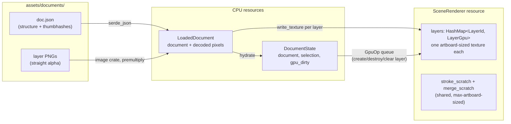
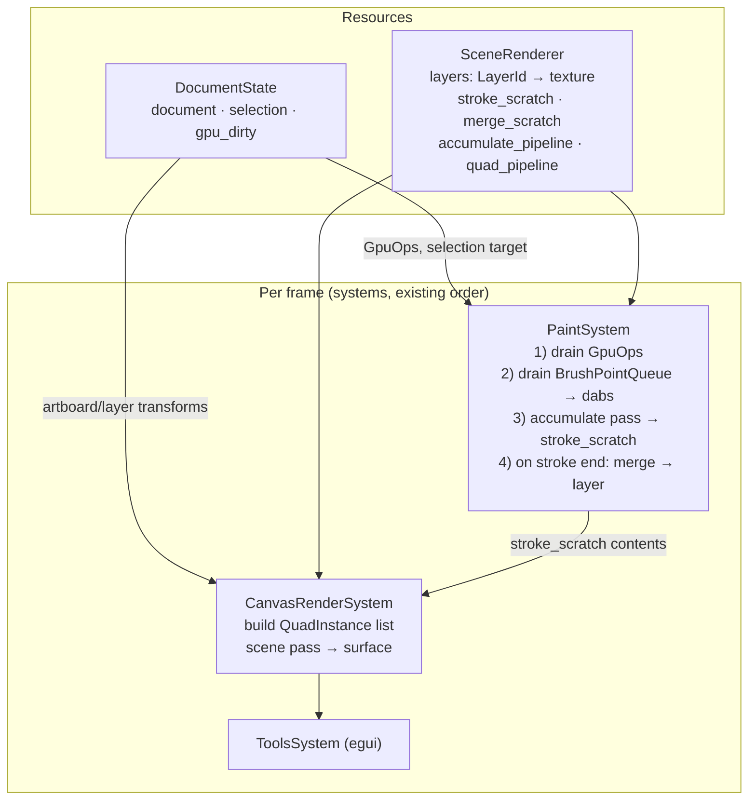
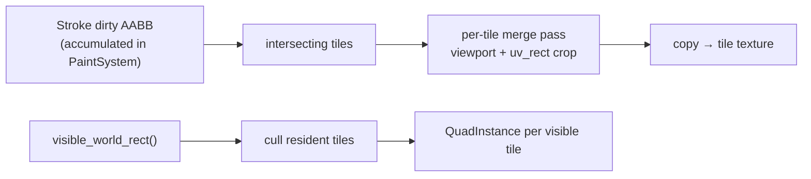
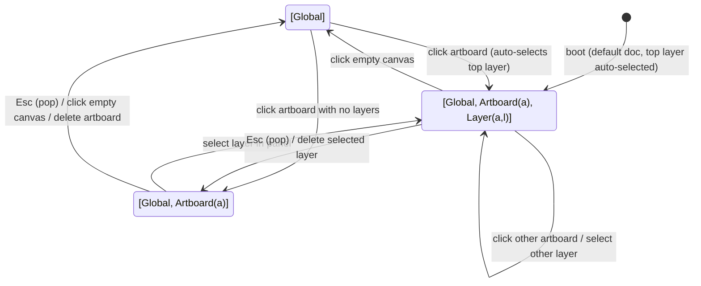
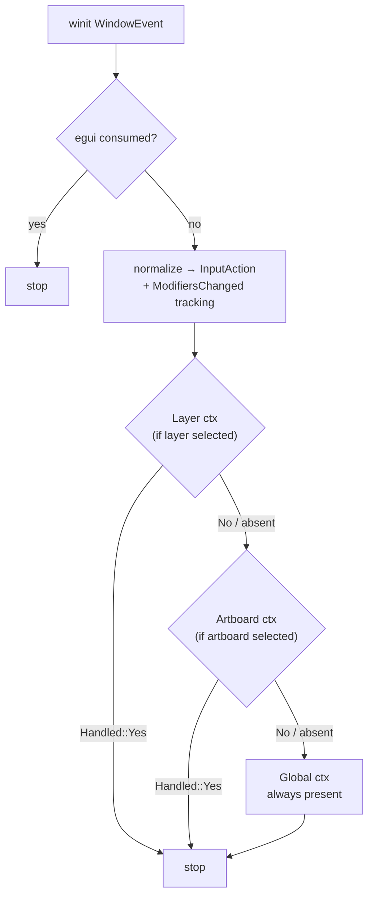

# Multi-Layer & Multi-Artboard Support

## Context

Crayon currently has exactly one drawable canvas: a window-sized ping-pong texture pair plus a transient stroke texture, composited by a single hardcoded shader (`camera.wgsl`). There is no document concept, no persistence, and input shortcuts are ad-hoc Cmd-state tracking duplicated across two controllers.

This plan adds:

- **Artboards** — positioned, sized rectangles in world space, each owning a stack of **layers** (bottom-to-top, normal blend).
- **A serde/JSON document model** loaded from an asset directory (hardcoded test documents), with layer rasters as PNG sidecar files and inline thumbhashes for cheap previews.
- **A renderer re-architecture**: one generic quad compositor draws N artboards × M layers; stroke accumulation targets the selected layer; ping-pong is eliminated.
- **A stack-based selection/hotkey model** (DOM capture/bubble style): actions dispatch from the innermost selection context (Layer) outward (Artboard → Global) until handled. Zoom is global; Cmd+drag moves the selected layer/artboard, or pans the camera when nothing is selected.
- Follow-up design sketches: tiled rendering, zoom-based LOD.

Decisions confirmed with the user:

- Layers are **per-artboard** (each artboard owns its stack).
- Persistence: **PNG sidecars referenced from JSON**, plus an inline **thumbhash** per layer (see §1.6).
- Selecting an artboard **auto-selects its topmost layer**, so drawing always works.
- Repositioned layers **clip at artboard bounds but keep their pixels** (offset is a pure transform; dragging back restores content).
- Zero minimum artboards/layers; default document has 1 artboard with 1 layer.

## Verified baseline (what the design builds on)

| Fact                                                                                                                                                                                               | Where                                                     |
| -------------------------------------------------------------------------------------------------------------------------------------------------------------------------------------------------- | --------------------------------------------------------- |
| `CanvasContext` owns ping-pong pair + stroke texture, window-sized, never resized on window resize                                                                                                 | `crayon/src/resources/canvas_state.rs`                    |
| Dabs batched into one instanced pass/frame; `DabInstance { center: canvas NDC, radius }`; radius applied isotropically in clip space (dabs are slightly elliptical in pixels — fixed by this plan) | `canvas_state.rs:402-457`, `dab.wgsl`                     |
| Merge pass composites stroke+canvas into the inactive ping-pong texture with an identity camera, swaps, clears stroke                                                                              | `canvas_state.rs:459-504`                                 |
| Camera is NDC-ish: `translation * scale`, y-scale multiplied by aspect ratio                                                                                                                       | `renderer/camera.rs:143-177`                              |
| `BrushPoint` positions are converted to screen NDC in `app.rs` before queueing; paint system inverts the per-point camera snapshot                                                                 | `app.rs:260`, `paint_system.rs:52-59`                     |
| Cmd/Super state tracked independently in `BrushController.is_disabled` and `CameraController.is_super_pressed` via `SuperLeft/SuperRight` key events                                               | `brush_controller.rs:42-54`, `camera_controller.rs:42-46` |
| `ControllerEvent → CustomEvent` relay is a hand-written match duplicated for native (mpsc thread) and wasm                                                                                         | `event_sender.rs:25-47`, `:67-89`                         |
| Startup schedule never runs (`_run_startup_systems` is dead code) — hydration must happen in `resumed()` / `CanvasCreated`                                                                         | `app.rs:70`                                               |
| wasm uses `Limits::downlevel_webgl2_defaults()`: max texture dim **2048**, 4 bind groups, no bindless/texture arrays                                                                               | `render_context.rs:41-42`                                 |
| egui consumes events first; canvas input only sees unconsumed events                                                                                                                               | `app.rs:380-390`                                          |
| No serde, no `image` crate in the workspace yet                                                                                                                                                    | `Cargo.toml`                                              |

---

# 1. Document Model

## 1.1 Overview

The document is the single source of truth for structure: artboards, layers, their positions, sizes, and raster content references. It is plain data (serde), owned by a `DocumentState` resource, and knows nothing about wgpu. GPU-side objects (one texture per layer) are _hydrated from_ the document at load and kept in sync through explicit `GpuOp`s — the CPU side never touches wgpu directly from event handlers.

Persistence layout on disk:

```
assets/documents/
├── default.json              # document structure + thumbhashes
├── default.layer-2.png       # one straight-alpha PNG per non-empty layer
└── two-boards.json           # additional hardcoded test documents
```

## 1.2 High-level architecture



## 1.3 Data structures — new module `crayon/src/document/mod.rs`

```rust
use serde::{Deserialize, Serialize};

#[derive(Serialize, Deserialize, Clone, Copy, PartialEq, Eq, Hash, Debug)]
#[serde(transparent)]
pub struct ArtboardId(pub u32);

#[derive(Serialize, Deserialize, Clone, Copy, PartialEq, Eq, Hash, Debug)]
#[serde(transparent)]
pub struct LayerId(pub u32);

#[derive(Serialize, Deserialize, Debug)]
pub struct Document {
    pub version: u32,               // = 1
    pub next_id: u32,               // monotonic id allocator (artboards + layers share it)
    pub artboards: Vec<Artboard>,   // draw order = index order (later = on top)
}

#[derive(Serialize, Deserialize, Debug)]
pub struct Artboard {
    pub id: ArtboardId,
    pub name: String,
    pub position: [f32; 2],   // top-left corner, world px (§2.2)
    pub size: [f32; 2],       // world px; clamped to device max texture dim on load
    pub layers: Vec<Layer>,   // bottom-to-top
}

#[derive(Serialize, Deserialize, Debug)]
pub struct Layer {
    pub id: LayerId,
    pub name: String,
    pub offset: [f32; 2],     // artboard-local px; repositioning mutates only this
    pub visible: bool,
    /// Relative path of a PNG next to the JSON file; None = blank (transparent) layer.
    pub content: Option<String>,
    /// Base64 thumbhash of the layer content for instant previews (§1.6). None for blank layers.
    pub thumbhash: Option<String>,
}
```

Key methods (all pure, unit-testable):

```rust
impl Document {
    pub fn default_document() -> Self;         // 1 artboard "Artboard 1" 800x600 @ (0,0), 1 blank layer
    pub fn alloc_artboard_id(&mut self) -> ArtboardId;   // next_id++, likewise for layers
    pub fn alloc_layer_id(&mut self) -> LayerId;
    pub fn artboard(&self, id: ArtboardId) -> Option<&Artboard>;
    pub fn artboard_mut(&mut self, id: ArtboardId) -> Option<&mut Artboard>;
    pub fn find_layer(&self, id: LayerId) -> Option<(ArtboardId, &Layer)>;
    /// Topmost artboard whose world rect contains `world` — iterate artboards in
    /// REVERSE draw order, point-in-rect on (position, size).
    pub fn hit_test(&self, world: cgmath::Point2<f32>) -> Option<ArtboardId>;
}
```

**Layer textures are artboard-sized, not layer-sized.** A layer's raster is exactly `artboard.size` pixels; `offset` repositions the quad at composite time and is a pure transform. This makes "move layer" free (no reallocation), keeps stroke targeting a simple coordinate subtraction, and directly implements the "clip at artboard, keep data" decision: pixels never move or get discarded, only the quad does. The memory trade-off (mostly-empty layers cost full artboard size) is addressed by the tiling follow-up (§2.9).

## 1.4 Dependencies

Workspace `Cargo.toml` + `crayon/Cargo.toml`:

```toml
serde = { version = "1", features = ["derive"] }
serde_json = "1"
image = { version = "0.25", default-features = false, features = ["png"] } # pure-Rust PNG, wasm-clean
thumbhash = "0.1" # pure Rust, wasm-clean
base64 = "0.22" # for thumbhash strings in JSON
```

## 1.5 JSON example — `assets/documents/default.json`

```json
{
  "version": 1,
  "next_id": 5,
  "artboards": [
    {
      "id": 1,
      "name": "Artboard 1",
      "position": [0.0, 0.0],
      "size": [800.0, 600.0],
      "layers": [
        {
          "id": 2,
          "name": "Background",
          "offset": [0.0, 0.0],
          "visible": true,
          "content": "default.layer-2.png",
          "thumbhash": "3OcRJYB4d3h/iIeHeEh3eIhw+j3A"
        },
        {
          "id": 3,
          "name": "Sketch",
          "offset": [24.0, 10.0],
          "visible": true,
          "content": null,
          "thumbhash": null
        }
      ]
    },
    {
      "id": 4,
      "name": "Artboard 2",
      "position": [880.0, 120.0],
      "size": [400.0, 400.0],
      "layers": []
    }
  ]
}
```

Rationale for PNG sidecars over base64-in-JSON: lossless compression instead of +33% base64 bloat, human-readable/diffable JSON, layers inspectable with any image viewer, and on wasm the sidecars are just extra fetches from the same asset dir. This matches the OpenRaster (`.ora`) precedent. PNGs are stored **straight-alpha**; the loader premultiplies on upload because the whole compositor works in premultiplied alpha (same reason documented in `dab.wgsl`).

## 1.6 Image resizing & thumbhash

Each layer carries an inline [thumbhash](https://crates.io/crates/thumbhash) — a ~25-byte perceptual hash that decodes to a blurry placeholder image. Uses:

- **Layer/artboard list previews in the UI** without decoding full PNGs or reading back GPU textures: decode the thumbhash to a small RGBA buffer once, upload as an `egui::TextureHandle`, cache by `LayerId`.
- **Instant visual feedback on wasm** while PNG fetches are in flight: hydrate layer textures with the _upscaled thumbhash pixels_ first, replace with real content when the fetch lands.

Generation pipeline (at save time, and for authoring the hardcoded test documents via a small `#[cfg(test)]` helper or offline script):

```rust
/// thumbhash requires input ≤ 100x100. Downscale preserving aspect ratio, then hash.
fn generate_thumbhash(rgba: &[u8], w: u32, h: u32) -> String {
    // image::imageops::thumbnail does a box filter; adequate for a placeholder hash.
    let img = image::RgbaImage::from_raw(w, h, rgba.to_vec()).unwrap();
    let (tw, th) = fit_within(w, h, 100, 100);          // preserve aspect, max side 100
    let small = image::imageops::thumbnail(&img, tw, th);
    let hash = thumbhash::rgba_to_thumb_hash(tw as usize, th as usize, small.as_raw());
    base64::engine::general_purpose::STANDARD.encode(hash)
}

/// UI-side decode, cached per LayerId:
fn thumbhash_preview(hash_b64: &str) -> (usize, usize, Vec<u8>) {
    let bytes = base64::engine::general_purpose::STANDARD.decode(hash_b64).unwrap();
    thumbhash::thumb_hash_to_rgba(&bytes).unwrap()      // ~32x32 RGBA
}
```

Note on resizing generally: `image::imageops::thumbnail` (box filter) is fine for hash input; if higher-quality downscales are ever needed (e.g. exporting), use `image::imageops::resize` with `FilterType::Lanczos3`. Thumbhash decode output is tiny (≤32px side) — upscaling for display is done by the sampler (egui bilinear), never on the CPU.

## 1.7 Load path — new file `crayon/src/document/loader.rs`

```rust
pub struct LoadedDocument {
    pub document: Document,
    /// Decoded, PREMULTIPLIED RGBA8 blocks keyed by layer, exactly artboard-sized.
    pub layer_pixels: HashMap<LayerId, Vec<u8>>,
}

#[cfg(not(target_arch = "wasm32"))]
pub fn load_document(name: &str) -> anyhow::Result<LoadedDocument> {
    // 1. resolve assets dir: exe_dir/assets/documents, falling back to
    //    concat!(env!("CARGO_MANIFEST_DIR"), "/assets/documents") for `cargo run`
    // 2. serde_json::from_str::<Document>(&fs::read_to_string(json_path)?)?
    // 3. validate: clamp artboard sizes to device max texture dim (pass limits in, or clamp
    //    to 2048 which is the wasm floor), dedupe ids -> anyhow::bail! on corruption
    // 4. for each layer with content: image::open -> to_rgba8 ->
    //    crop/pad into an artboard-sized buffer -> premultiply in place
    // 5. blank layers get no entry (hydration clears to TRANSPARENT)
}

#[cfg(target_arch = "wasm32")]
pub async fn load_document(name: &str) -> anyhow::Result<LoadedDocument>;
// fetch("./assets/documents/{name}.json") via web_sys, then fetch each PNG as
// ArrayBuffer, decode with `image`. Add web-sys features: Request, RequestInit,
// Response, Headers. Completion is delivered as CustomEvent::DocumentLoaded (§1.8).
```

On any load failure: log and fall back to `Document::default_document()` — the app must always boot.

## 1.8 GPU hydration

`SceneRenderer::hydrate(&mut self, render_ctx, &LoadedDocument)` (§2.3): for each layer, create an artboard-sized texture + bind group, then `queue.write_texture` the decoded pixels (or clear to TRANSPARENT when absent).

Hydration is inline at each render-context creation site — **not** a `Schedule::Startup` system. A `System` receives `&App` and cannot create resources; hydration needs `RenderContext`/`SceneRenderer` to already exist, and on wasm those don't exist until the canvas mounts and resizes (`CanvasCreated`), with the real layer content arriving later still via async `DocumentLoaded`. No single startup moment holds all the inputs, so it can't be a startup system (which stays reserved for canvas-independent run-once logic). Call sites:

- **Native**: end of `resumed()` (`app.rs:170-187`), right after `SceneRenderer` is inserted.
- **wasm**: `CustomEvent::CanvasCreated` arm hydrates the default document immediately; the async fetch completes via a new `CustomEvent::DocumentLoaded(Box<LoadedDocument>)` whose handler atomically replaces `DocumentState` + all `SceneRenderer` layer textures (single `user_event` arm — no partial states). Until it arrives, thumbhash placeholders render (§1.6).

Texture formats: layer textures use the surface-format family (`Rgba8UnormSrgb` native / `Rgba8Unorm` wasm — same cfg split that already selects `dab_linear.wgsl` vs `dab.wgsl`). All layer + scratch textures must share one format so `copy_texture_to_texture` in the merge (§2.6) is legal.

---

# 2. Renderer Re-architecture

## 2.1 Overview

`CanvasContext` (535 lines, `resources/canvas_state.rs`) is deleted and replaced by two resources:

- **`DocumentState`** (CPU): the `Document`, the `SelectionStack` (§3), and a `gpu_dirty: Vec<GpuOp>` queue for structural changes.
- **`SceneRenderer`** (GPU): per-layer textures, the two shared scratch textures, the dab-accumulation pipeline (kept from today), and a new generic **quad compositor** pipeline that draws everything visible — artboard backgrounds, layers, live stroke — as textured world-space quads under one camera transform.

The single-pass dab accumulation is preserved unchanged in spirit: all of a frame's dabs still go into one instanced draw, targeting a shared `stroke_scratch` texture, with a viewport confined to the active layer's size. Ping-pong is **eliminated**: merging uses a shared `merge_scratch` + `copy_texture_to_texture` back into the layer, halving per-layer memory.



## 2.2 Coordinate spaces (the load-bearing change)

Documented in a doc comment in `camera.rs`. All spaces are y-down except clip space.

| Space              | Units | Definition                                                                               |
| ------------------ | ----- | ---------------------------------------------------------------------------------------- |
| **World**          | px    | Origin arbitrary. Artboard `position`/`size` live here.                                  |
| **Artboard-local** | px    | `world - artboard.position`                                                              |
| **Layer-local**    | px    | `artboard_local - layer.offset`. Equals layer texel space (textures are artboard-sized). |
| **Layer clip**     | NDC   | Accumulate-pass target: `x = local.x/(w/2) - 1`, `y = 1 - local.y/(h/2)`                 |
| **Clip/NDC**       | —     | Produced only by `Camera2D`.                                                             |

`Camera2D` (`renderer/camera.rs`) is reworked to world-pixel semantics. `translation` becomes **the world-px point at the viewport center**:

```rust
pub fn world_to_clip_matrix(&self) -> Matrix4<f32>;
// clip.x =  2*scale/vw * (world.x - translation.x)
// clip.y = -2*scale/vh * (world.y - translation.y)     // y flip lives here
pub fn screen_to_world(&self, screen_px: Point2<f32>) -> Point2<f32>;
// world = translation + (screen_px - viewport/2) / scale
pub fn visible_world_rect(&self) -> Rect;               // for culling + tiling follow-up
```

Retired: `build_2d_transform_matrix`, `build_2d_inverse_transform_matrix`, the `aspect_ratio` y-scaling (aspect is now inherent in `2/vw`, `2/vh`), `screen_to_ndc`/`screen_to_world_position` usage in `app.rs:215/260`, and `adjust_scale_for_resize` (world px are resize-invariant). `DEFAULT_CANVAS_ZOOM` becomes `1.0`; zoom clamps `[0.1, 10.0]` unchanged. Every consumer must be audited — the checklist is in §6 (Risks).

## 2.3 `SceneRenderer` — new file `crayon/src/resources/scene_renderer.rs`

```rust
pub struct LayerGpu {
    pub texture: CRTexture,
    pub bind_group: wgpu::BindGroup,   // reuses today's texture bind group layout
    pub size: (u32, u32),
}

pub struct SceneRenderer {
    // ---- dab accumulation (pipeline kept, instance layout updated §2.5) ----
    accumulate_pipeline: wgpu::RenderPipeline,        // dab.wgsl / dab_linear.wgsl
    dab_uniform_buffer: wgpu::Buffer,                 // color + layer_size (§2.5)
    dab_uniform_bind_group: wgpu::BindGroup,
    dab_instance_buffer: wgpu::Buffer,
    dab_scratch: Vec<DabInstance>,                    // CPU staging, capacity 1024

    // ---- shared scratch, sized to max artboard dims, grown on demand ----
    stroke_scratch: CRTexture, stroke_bind_group: wgpu::BindGroup,
    merge_scratch:  CRTexture, merge_bind_group:  wgpu::BindGroup,
    scratch_size: (u32, u32),

    // ---- quad compositor (replaces camera pipeline entirely) ----
    quad_pipeline: wgpu::RenderPipeline,              // quad.wgsl, premultiplied blend
    quad_instance_buffer: wgpu::Buffer,               // QuadInstance slots, grown on demand
    camera_uniform: CameraUniform,
    camera_buffer: wgpu::Buffer, camera_bind_group: wgpu::BindGroup,
    scratch_ortho_bind_group: wgpu::BindGroup,        // pixel→NDC ortho for merge pass (§2.6)
    white_texture: CRTexture, white_bind_group: wgpu::BindGroup,   // 1x1 white, artboard bg

    pub layers: HashMap<LayerId, LayerGpu>,
    texture_bind_group_layout: wgpu::BindGroupLayout,
}

impl SceneRenderer {
    pub fn new(render_ctx: &RenderContext) -> Self;   // NO window-size dependency
    pub fn hydrate(&mut self, render_ctx: &RenderContext, doc: &LoadedDocument);
    pub fn create_layer(&mut self, render_ctx: &RenderContext, id: LayerId, size: (u32, u32));
    pub fn destroy_layer(&mut self, id: LayerId);
    pub fn clear_layer(&mut self, render_ctx: &RenderContext, id: LayerId);
    pub fn ensure_scratch(&mut self, render_ctx: &RenderContext, size: (u32, u32));
    pub fn update_camera_buffer(&mut self, render_ctx: &RenderContext, camera: &Camera2D);
    pub fn update_brush(&mut self, render_ctx: &RenderContext, color: [f32; 4]);   // as today
    pub fn begin_dabs(&mut self) -> &mut Vec<DabInstance>;                          // as today
    pub fn upload_dabs(&self, render_ctx: &RenderContext) -> u32;                   // as today
    pub fn accumulate_stroke(&self, encoder: &mut wgpu::CommandEncoder,
                             clear: bool, count: u32, layer_size: (u32, u32));
    pub fn merge_stroke_into_layer(&mut self, encoder: &mut wgpu::CommandEncoder, layer: LayerId);
    pub fn upload_quads(&mut self, render_ctx: &RenderContext, quads: &[QuadInstance]);
}
```

`DocumentState` — new file `crayon/src/resources/document_state.rs`:

```rust
pub struct DocumentState {
    pub document: Document,
    pub selection: SelectionStack,     // §3.1
    pub gpu_dirty: Vec<GpuOp>,
}
pub enum GpuOp {
    CreateLayer { layer: LayerId, size: (u32, u32) },
    DestroyLayer { layer: LayerId },
    ClearLayer { layer: LayerId },
}
```

Event handlers mutate `document` and push `GpuOp`s; `PaintSystem` drains `gpu_dirty` at the top of its run (before any pass is recorded) and applies them to `SceneRenderer`. This keeps all wgpu calls out of the winit-event path, and guarantees `ensure_scratch` reallocation never happens mid-recorded-stroke.

## 2.4 The quad compositor — new shader `renderer/shaders/quad.wgsl`

One pipeline draws every visible rectangle. Per-quad data rides in an instance-step vertex buffer — no dynamic uniform offsets, no per-quad uniforms; WebGL-safe (2 bind groups) and matches the codebase's instancing idiom from `dab.wgsl`:

```rust
#[repr(C)] #[derive(Copy, Clone, bytemuck::Pod, bytemuck::Zeroable)]
pub struct QuadInstance {
    pub origin: [f32; 2],    // world px, top-left
    pub size:   [f32; 2],    // world px
    pub uv_rect: [f32; 4],   // uv min.xy, max.xy — subrect for scratch textures, else (0,0,1,1)
}
```

```wgsl
struct CameraUniform { view_projection: mat4x4<f32> };
@group(0) @binding(0) var<uniform> camera: CameraUniform;
@group(1) @binding(0) var t: texture_2d<f32>;
@group(1) @binding(1) var s: sampler;

struct VsOut { @builtin(position) clip: vec4<f32>, @location(0) uv: vec2<f32> };

@vertex
fn vs_main(@builtin(vertex_index) vi: u32,
           @location(0) origin: vec2<f32>, @location(1) size: vec2<f32>,
           @location(2) uv_rect: vec4<f32>) -> VsOut {
    // corner01: (0,0)(1,0)(1,1) (0,0)(1,1)(0,1) from vi — same trick as dab.wgsl
    let corner01 = quad_corner(vi);
    let world = origin + corner01 * size;
    var out: VsOut;
    out.clip = camera.view_projection * vec4<f32>(world, 0.0, 1.0);
    out.uv = mix(uv_rect.xy, uv_rect.zw, corner01);
    return out;
}

@fragment
fn fs_main(in: VsOut) -> @location(0) vec4<f32> {
    return textureSample(t, s, in.uv);   // premultiplied; PREMULTIPLIED_ALPHA blend state does the rest
}
```

Draw loop: quads pre-uploaded in one buffer; per quad `set_bind_group(1, …)` + `draw(0..6, i..i+1)`. Deleted: `camera.wgsl`, its 3-bind-group layout, `DISPLAY_VERTICES` + index buffer (`renderer/camera.rs:33-54`) — corners come from `vertex_index`.

## 2.5 Stroke accumulation changes (`paint_system.rs`, `dab.wgsl`)

Behavior change flagged: the per-point transform chain becomes

```
screen px ──camera snapshot.screen_to_world──▶ world px
          ──(− artboard.position − layer.offset)──▶ layer-local px
          ──(/ (size/2), flip y, −1..1)──▶ layer clip
```

- `Dot2D.position` now carries **raw screen px** (drop the `screen_to_ndc` call at `app.rs:260`).
- `BrushPointData` grows `target: (ArtboardId, LayerId)` captured **at enqueue time** — a selection change mid-flight cannot retarget queued points.
- `StrokeState` gains `pub target: Option<(ArtboardId, LayerId)>`, set on `StrokeStart` from the selection, consumed by the merge. `StrokeStart` with no selected layer is dropped.
- `DabInstance` becomes `{ center: [f32; 2] /* layer clip */, radius_px: f32 }`. Brush radius is now defined in **world px** and multiplied by the point's camera scale is _not_ applied — dabs live in layer space, so zooming visually scales the brush for free.
- `dab.wgsl` / `dab_linear.wgsl`: the existing `DabUniform` grows `layer_size: vec2<f32>` (updated per stroke); vertex computes `clip_offset = corner * radius_px * vec2(2.0/layer_size.x, 2.0/layer_size.y)`. This per-axis conversion also fixes the current elliptical-dab artifact.
- `accumulate_stroke(…, layer_size)` sets `set_viewport(0, 0, layer_w, layer_h)` on the `stroke_scratch` pass so only the active layer's region is touched; clear on stroke start as today.

`PaintSystem::run` pseudo-code:

```rust
fn run(&self, app: &App) {
    let (render_ctx, scene, doc, queue, stroke_state, preview) = /* resource locks */;

    // 0. structural ops first — never mid-stroke reallocation
    for op in doc.gpu_dirty.drain(..) { scene.apply(op, &render_ctx); }

    // 1. drain queue → dabs in layer clip space
    let dabs = scene.begin_dabs();
    while let Some(p) = queue.read() {
        let Some((aid, lid)) = p.target else { continue };
        let Some(ab) = doc.document.artboard(aid) else { continue };   // deleted mid-flight
        let Some(layer) = /* find layer lid in ab */ else { continue };
        let world = p.camera.screen_to_world(p.dot.position);
        let local = world - ab.position - layer.offset;                // layer-local px
        dabs.push(DabInstance {
            center: [local.x / (w * 0.5) - 1.0, 1.0 - local.y / (h * 0.5)],
            radius_px: p.dot.radius,
        });
    }

    // 2/3. upload + accumulate (unchanged shape)
    let n = scene.upload_dabs(&render_ctx);
    if clear || n > 0 { scene.accumulate_stroke(encoder, clear, n, layer_size); }

    // 4. merge on stroke end — only if the target still exists
    if merge && let Some((_, lid)) = stroke_state.target
             && scene.layers.contains_key(&lid) {
        scene.merge_stroke_into_layer(encoder, lid);
    }
}
```

## 2.6 Merge without ping-pong

`merge_stroke_into_layer` records, in order:

1. **Merge pass** → `merge_scratch`: viewport = layer size, `LoadOp::Clear(TRANSPARENT)`, quad pipeline with `scratch_ortho_bind_group` (a fixed pixel→NDC ortho for scratch pixel space, replacing today's `identity_camera_bind_group`). Draw the layer texture quad `(origin (0,0), size layer_size)`, then the stroke quad on top (`uv_rect` cropping `stroke_scratch` to `layer_size / scratch_size`), premultiplied blend.
2. `encoder.copy_texture_to_texture(merge_scratch → layers[id].texture, layer_size extent)` — legal: identical formats, exact sizes, and the destination is never sampled in the same pass.
3. Clear pass on `stroke_scratch` (today's `clear_stroke_texture` logic).

This replaces `record_merge_and_clear` (`canvas_state.rs:459-504`). Cost: one GPU-side copy per stroke end instead of 2× texture memory on every layer.

## 2.7 Scene pass (`systems/canvas_render_system.rs`, rewritten)

Builds `Vec<QuadInstance>` + a parallel `Vec<QuadBinding>` (`enum QuadBinding { White, Layer(LayerId), Stroke }`), uploads once, then draws with the surface as target, `LoadOp::Clear(CLEAR_COLOR)`, camera bind group at group 0:

```rust
for artboard in &doc.document.artboards {
    // background: opaque white quad at (artboard.position, artboard.size)
    push(QuadInstance { origin, size, uv_rect: FULL }, QuadBinding::White);

    // CLIP TO ARTBOARD: compute the artboard's screen-space rect via
    // camera.world_to_clip → pixels, clamp to surface bounds, and
    // pass.set_scissor_rect(...) before drawing this artboard's layers.
    // This implements "clip at artboard, keep data": a layer dragged past the
    // edge is visually clipped, its texture untouched. Skip the artboard
    // entirely if the scissor rect is empty (fully off-screen — free culling).

    for layer in artboard.layers.iter().filter(|l| l.visible) {   // bottom → top
        push(QuadInstance { origin: ab.position + layer.offset, size: ab.size, uv_rect: FULL },
             QuadBinding::Layer(layer.id));
        if selection.selected_layer() == Some((artboard.id, layer.id)) && stroke_active {
            // live stroke sits exactly at its layer's position within the stack —
            // preserves the visual behavior camera.wgsl hardcoded for 1 canvas + 1 stroke
            push(QuadInstance { origin: same, size: same,
                                uv_rect: [0,0, layer_w/scratch_w, layer_h/scratch_h] },
                 QuadBinding::Stroke);
        }
    }
    // reset scissor to full surface after each artboard
}
```

Scissor rects are integer-pixel and must be clamped to the render target — compute once per artboard from `camera`. (WebGL supports scissor; no compatibility concern.)

Selected-artboard outline: drawn with an egui foreground painter in the layer panel widget (world→screen via camera) — no new wgpu pipeline.

Render pass count per frame, steady state: **3** (accumulate → scene → egui), exactly as today. Stroke end adds the merge pass + copy, once.

## 2.8 Memory strategy

- 1 texture per layer (artboard-sized), no ping-pong: e.g. 3 artboards of 1024² × 4 layers = 48 MB + scratch.
- 2 shared scratch textures at max-artboard size (`ensure_scratch` grows them inside the `GpuOp` drain — never mid-stroke; growth is triggered by document load and by `AddArtboard` with larger dims).
- 1×1 white texture for artboard backgrounds.
- Artboard size clamped to `device.limits().max_texture_dimension_2d` — **2048 on wasm/WebGL** — at document load and in the `AddArtboard` action.

## 2.9 Follow-up: tiled rendering

Design sketch (not part of the initial implementation):

- Replace each layer's monolithic texture with `LayerGpu::tiles: HashMap<(i32, i32), TileGpu>` of fixed **256 px** tiles, allocated lazily on first dab intersection.
- Accumulate pass unchanged (`stroke_scratch` stays monolithic per-stroke, bounded by artboard size). `PaintSystem` accumulates a per-stroke dirty AABB; the merge runs the §2.6 pass **per intersecting tile** with a per-tile viewport + `uv_rect`, copying into that tile.
- Scene pass emits one `QuadInstance` per resident tile, culled against `Camera2D::visible_world_rect()`. The `QuadInstance { origin, size, uv_rect }` format already supports this **unchanged**.
- Wins: memory proportional to painted area (fixes the empty-layer cost of §1.3), natural dirty-rect merging, per-tile eviction. Persistence: one PNG per tile, or repack to a full PNG at save.



## 2.10 Follow-up: level of detail (zoom)

- Add mip chains to layer (later: tile) textures: `mip_level_count = floor(log2(max_dim)) + 1`. WebGL has no compute — generate mips with a chain of render passes using the quad pipeline, each sampling the previous level (viewport halves each pass), after every merge.
- `texture.rs:47-48` currently uses `mipmap_filter: Nearest` — switch layer samplers to `min_filter: Linear, mipmap_filter: Linear` so zoom-out (`scale < 1`) stops shimmering.
- Extreme zoom-out with tiling: keep a per-artboard **proxy texture** at 1/8 resolution, updated lazily from merges; when `scale * artboard_size < proxy_size`, draw the whole artboard as one proxy quad — collapses draw count and bandwidth simultaneously.
- The §1.6 thumbhash is the degenerate case of this ladder (proxy-of-last-resort while content loads).

---

# 3. Hotkey / Selection Re-architecture

## 3.1 Overview & selection stack

Selection is a stack of nested contexts, innermost = most specific — the direct analogue of the DOM event path. Actions dispatch innermost → outermost until a handler claims them (bubble phase). Zoom bubbles to Global; Cmd+drag is claimed by the Layer context when a layer is selected, else Artboard, else Global (camera pan — current behavior preserved).

New file `crayon/src/input/selection.rs`:

```rust
#[derive(Clone, Copy, PartialEq, Debug)]
pub enum SelectionCtx {
    Global,
    Artboard(ArtboardId),
    Layer(ArtboardId, LayerId),
}

/// Invariant: stack[0] == Global. Legal states:
/// [Global] · [Global, Artboard(a)] · [Global, Artboard(a), Layer(a, l)]
pub struct SelectionStack { stack: Vec<SelectionCtx> }

impl SelectionStack {
    pub fn contexts_inner_to_outer(&self) -> impl Iterator<Item = SelectionCtx> + '_; // .rev()
    pub fn select_artboard(&mut self, doc: &Document, id: ArtboardId);
    //   → [Global, Artboard(id), Layer(id, topmost)]   // auto-select top layer (user decision);
    //   → [Global, Artboard(id)] if the artboard has no layers
    pub fn select_layer(&mut self, a: ArtboardId, l: LayerId);
    pub fn pop(&mut self);                               // Esc: one frame off (never pops Global)
    pub fn clear(&mut self);                             // → [Global]
    pub fn selected_layer(&self) -> Option<(ArtboardId, LayerId)>;
    pub fn selected_artboard(&self) -> Option<ArtboardId>;
    pub fn on_artboard_deleted(&mut self, id: ArtboardId);  // pop invalidated frames
    pub fn on_layer_deleted(&mut self, id: LayerId);
}
```

Lives in `DocumentState.selection`. Default document → topmost layer selected at boot, so drawing works immediately.



## 3.2 Dispatch model

New files `crayon/src/input/{mod.rs, selection.rs, dispatch.rs, layer_handler.rs, artboard_handler.rs, global_handler.rs}`. Raw winit events are normalized once into `InputAction`s, then bubbled:

```rust
pub enum InputAction {
    PointerDown { screen: Point2<f32> },
    PointerMove { screen: Point2<f32> },
    PointerUp   { screen: Point2<f32> },
    Scroll      { delta: f32, screen: Point2<f32> },
    Key         { code: KeyCode, pressed: bool },
}

pub struct DispatchEnv<'a> {
    pub modifiers: ModifiersState,   // tracked ONCE via WindowEvent::ModifiersChanged
    pub camera: Camera2D,            // snapshot for screen_to_world
    pub doc: &'a Document,           // hit-testing, rects
    pub selection: &'a SelectionStack,
    pub brush_size: f32,
    pub sender: &'a EventSender,
}

pub enum Handled { Yes, No }

pub trait ContextHandler {
    fn handle(&mut self, ctx: SelectionCtx, action: &InputAction, env: &DispatchEnv) -> Handled;
}
```

`InputSystem` (`resources/input_system.rs`) becomes the dispatcher; `brush_controller.rs` and `camera_controller.rs` are **deleted**, their machinery absorbed:

```rust
pub struct InputSystem {
    modifiers: ModifiersState,
    cursor: Point2<f32>,
    layer_handler: LayerContextHandler,       // stroke machinery (PointProcessor etc.,
                                              //   moved ~verbatim from BrushController) + move-layer drag
    artboard_handler: ArtboardContextHandler, // move-artboard drag, click-to-select-layer routing
    global_handler: GlobalContextHandler,     // camera pan/zoom, artboard hit-select, app hotkeys
}

impl InputSystem {
    pub fn process_event(&mut self, event: &WindowEvent, env: &DispatchEnv) {
        // 1. WindowEvent::ModifiersChanged → self.modifiers = new; return
        //    (replaces BOTH controllers' SuperLeft/SuperRight tracking; also immune
        //     to the stuck-modifier-on-focus-loss bug the key-tracking approach has)
        // 2. normalize CursorMoved / MouseInput / MouseWheel / KeyboardInput → InputAction
        // 3. bubble:
        for ctx in env.selection.contexts_inner_to_outer() {
            let handler: &mut dyn ContextHandler = match ctx {
                SelectionCtx::Layer(..)    => &mut self.layer_handler,
                SelectionCtx::Artboard(..) => &mut self.artboard_handler,
                SelectionCtx::Global       => &mut self.global_handler,
            };
            if let Handled::Yes = handler.handle(ctx, &action, env) { break; }
        }
    }
}
```

`app.rs window_event` (the `event =>` arm at `:380`) builds `DispatchEnv` from `State`/`DocumentState`/`EventSender` and calls `process_event`. **egui-first ordering untouched** (`app.rs:380-390`) — panel clicks never reach the dispatcher, which is the entire UI-vs-canvas hit-testing story.



## 3.3 Handler behavior table (replaces all scattered Cmd tracking)

| Action                      | Layer ctx                                                       | Artboard ctx                                                                 | Global ctx                                                                                                   |
| --------------------------- | --------------------------------------------------------------- | ---------------------------------------------------------------------------- | ------------------------------------------------------------------------------------------------------------ |
| PointerDown, no Cmd         | inside own artboard → `StrokeStart`, **Yes**; outside → **No**  | inside own artboard → select top layer + `StrokeStart`, **Yes**; else **No** | hit-test artboards (reverse draw order): hit → `SelectArtboard(id)` **Yes**; miss → `ClearSelection` **Yes** |
| PointerMove (stroke active) | feed `PointProcessor`, emit `BrushPoint { screen px }`, **Yes** | —                                                                            | —                                                                                                            |
| Cmd + drag                  | `MoveLayer { layer, world_delta }`, **Yes**                     | `MoveArtboard { artboard, world_delta }`, **Yes**                            | camera pan (current behavior), **Yes**                                                                       |
| Cmd + scroll                | **No** (bubbles)                                                | **No** (bubbles)                                                             | camera zoom, **Yes**                                                                                         |
| Cmd + R                     | `ClearLayer(selected)`, **Yes**                                 | **No**                                                                       | **No** — global clear-canvas retired                                                                         |
| Esc                         | **No** (bubbles)                                                | **No** (bubbles)                                                             | pop one selection frame; at `[Global]` already → exit app (moves `app.rs:398-410` logic)                     |

Drag deltas are converted where the semantics live: `world_delta = screen_delta / camera.scale` for layer/artboard moves **and** camera pan (at 2× zoom the content follows the cursor 1:1 only with this division). `CameraMove` changes payload from accumulated-NDC-offset to `{ world_delta: Vector2<f32> }`, and the `clamp::clamp_point` NDC pan clamp is dropped initially (behavior change flagged: the camera can be scrolled to empty space; a "keep some artboard in view" clamp can come later).

## 3.4 Event plumbing (`events.rs`, `event_sender.rs`, `app.rs`)

**Refactor first (Step 0):** `impl From<ControllerEvent> for CustomEvent`, collapse both hand-written relay matches (`event_sender.rs:25-47`, `:67-89`) to `proxy.send_event(event.into())` — today every new variant is triple-maintained. `CanvasCreated`/`DocumentLoaded` stay outside the `From` impl (they're not controller events).

New variants:

```rust
SelectArtboard(ArtboardId), SelectLayer(ArtboardId, LayerId), ClearSelection,
MoveLayer { layer: LayerId, world_delta: Vector2<f32> },
MoveArtboard { artboard: ArtboardId, world_delta: Vector2<f32> },
AddLayer { artboard: ArtboardId }, DeleteLayer { layer: LayerId },
AddArtboard, DeleteArtboard { artboard: ArtboardId },
ClearLayer { layer: LayerId }, ToggleLayerVisibility(LayerId),
// CameraMove payload → { world_delta }; ClearCanvas removed
```

New `user_event` arms in `app.rs` mutate `DocumentState`:

- `MoveLayer` / `MoveArtboard`: pure CPU — mutate `offset` / `position`; the quad origin changes next frame, zero GPU work.
- `AddLayer` / `AddArtboard`: allocate id, insert into document (new artboard: default 800×600, placed at a free spot right of the current rightmost artboard; clamp to max texture dim), push `GpuOp::CreateLayer`, select it.
- `DeleteLayer` / `DeleteArtboard`: if a stroke is active on an affected layer, reset `StrokeState` first (abort, no merge); remove from document; `selection.on_*_deleted`; push `GpuOp::DestroyLayer` per affected layer.
- `StrokeStart`: `stroke_state.target = selection.selected_layer()`; drop if `None`.

---

# 4. UI (egui)

New file `crayon/src/renderer/ui/layer_panel_widget.rs` implementing the existing `Drawable` trait (`renderer/ui/drawable.rs`), registered in `ToolsSystem::new()`'s array (6 → 7 entries):

- `egui::SidePanel::right("layers")`. Existing widgets are floating `Window`s; a side panel coexists fine and its events are already swallowed by egui-first routing.
- **Artboards section**: one selectable row per artboard (name + thumbhash preview of its top layer); click → `SelectArtboard`; highlight from `selection.selected_artboard()`. `+` → `AddArtboard`; per-row trash → `DeleteArtboard`.
- **Layers section** (when an artboard is selected): rows top-to-bottom = `layers.iter().rev()`; thumbhash preview (§1.6, cached `egui::TextureHandle` per `LayerId`); click → `SelectLayer`; eye toggle → `ToggleLayerVisibility`; `+` → `AddLayer`; trash → `DeleteLayer`. Empty states ("no artboards", "no layers") with just the `+` button — zero minimum is legal.
- Selected-artboard outline drawn via `egui::Painter` (foreground layer), world→screen through the camera.
- Data access pattern copied from `ClearScreenWidget`: `app.read::<DocumentState>()` for display, `app.read::<EventSender>()` to send. **All mutations event-based** — no widget takes `write::<DocumentState>()` (lock discipline, §6).
- `ClearScreenWidget` is repurposed: sends `ClearLayer(selected)`, disabled when no layer is selected.

---

# 5. Migration steps (dependency order)

**Step 0 — pure refactors, no behavior change:**

1. `event_sender.rs`: `From<ControllerEvent> for CustomEvent`; collapse both relays.
2. `app.rs`: rename/wire `_run_startup_systems` (or explicitly keep hydration inline — plan assumes inline + rename as cleanup).
3. `InputSystem`: track `WindowEvent::ModifiersChanged`; delete SuperLeft/SuperRight tracking in both controllers (behavior-preserving).

**Step 1 — document model (compiles standalone):**
4. Add serde / serde_json / image / thumbhash / base64 deps.
5. `crayon/src/document/{mod.rs, loader.rs}`; `assets/documents/default.json` + one hand-made PNG + a second test document; unit tests (§7).

**Step 2 — camera to world-px space:**
6. Rework `renderer/camera.rs` (`world_to_clip_matrix`, `screen_to_world`, `visible_world_rect`, translation semantics, `DEFAULT_CANVAS_ZOOM → 1.0`); update `constants.rs`.
7. Update `app.rs` `CameraMove`/`CameraZoom`/resize arms; drop `adjust_scale_for_resize`, NDC pan clamp.

**Step 3 — renderer:**
8. `quad.wgsl`; extend `dab.wgsl`/`dab_linear.wgsl` (`radius_px` + `layer_size` uniform).
9. `resources/{scene_renderer.rs, document_state.rs}`; delete `resources/canvas_state.rs`, `camera.wgsl`, `DISPLAY_VERTICES`.
10. Rewrite `systems/canvas_render_system.rs` (quad list + per-artboard scissor) and `systems/paint_system.rs` (GpuOp drain, target-layer transform chain, `merge_stroke_into_layer`); update `stroke_state.rs` (target), `brush_point_queue.rs` (target + screen-px dot).
11. `app.rs`: insert `DocumentState` + `SceneRenderer`; hydration call sites; wasm `DocumentLoaded` arm. (`State` keeps camera + editor; `DocumentState` stays separate to limit write-lock contention.)

**Step 4 — input:**
12. `crayon/src/input/` module (selection, dispatch, 3 handlers); rewrite `resources/input_system.rs`; **delete** `brush_controller.rs`, `camera_controller.rs`; extend `events.rs`; new `user_event` arms.

**Step 5 — UI:**
13. `renderer/ui/layer_panel_widget.rs`; register in `tools_system.rs`; repurpose `clear_screen_widget.rs`.

**Step 6 — verification (§7).**

Critical files: `resources/canvas_state.rs` (deleted → `scene_renderer.rs`), `app.rs`, `systems/paint_system.rs`, `renderer/camera.rs`, `resources/input_system.rs`.

---

# 6. Risks and tricky spots

- **Merge correctness without ping-pong**: `copy_texture_to_texture` needs identical formats and no same-pass sampling of the destination — respected by §2.6, but the merge pass **must** use `LoadOp::Clear(TRANSPARENT)` + premultiplied blend or edge fringes appear (the exact bug class the `dab.wgsl` comment warns about).
- **Scratch reallocation mid-stroke**: `ensure_scratch` only runs in the `GpuOp` drain at the top of `PaintSystem`, and `AddArtboard` pushes its op before any stroke can start on the new artboard.
- **Stale stroke targets**: `BrushPoint`s cross a thread + user_event on native; selection can change mid-flight. Capturing the target in `BrushPointData` (enqueue) and `StrokeState` (`StrokeStart`) makes the pipeline immune. `DeleteLayer` mid-stroke aborts the stroke before `DestroyLayer`; `merge_stroke_into_layer` no-ops if the id is gone.
- **wasm limits**: 2048 max texture dimension under `downlevel_webgl2_defaults` — clamp at load and in `AddArtboard`. Async fetch means frames render the default document before `DocumentLoaded`; that arm replaces `DocumentState` + layer textures atomically.
- **Camera semantics audit** (every old-NDC consumer): `screen_to_world_position` use at `app.rs:215`, `screen_to_ndc` at `app.rs:260`, `clamp::clamp_point`, and `BrushPreviewState` — the preview offset math at `paint_system.rs:63-68` (`x+1, y-1`) breaks silently unless it is fed screen px directly.
- **Scissor-rect edge cases**: integer clamp to surface bounds; empty rect (artboard fully off-screen) must skip draws — wgpu panics on zero-area scissor.
- **Draw-call growth**: one draw per layer + one per artboard background — trivial until hundreds of layers; tiling (§2.9) subsumes.
- **Lock discipline**: keep all UI mutations event-based (`EventSender`); no widget takes `write::<DocumentState>()` while systems hold reads. `PaintSystem` holds `write::<SceneRenderer>` + `write::<DocumentState>` (GpuOp drain) — acquire in one place, consistent order.
- **Thumbhash staleness**: hashes regenerate only at save; after in-session edits, previews lag content. Acceptable for this milestone (no save yet — documents are hardcoded test assets).

# 7. Verification

- `cargo test -p crayon --lib -p batteries`: new unit tests — document serde round-trip, `hit_test` (overlap → topmost wins, miss → None), `default_document`, selection-stack transitions (all edges of the §3.1 state diagram, delete-invalidation), dispatch bubbling with a mock `EventSender` (Cmd+drag → MoveLayer with layer selected, camera pan with none; zoom bubbles to Global from any state), thumbhash round-trip.
- `cargo clippy` (repo convention — see recent "clippy" commit), `cargo build --target wasm32-unknown-unknown`.
- Manual, native (`cargo run`) against `default.json` and a second multi-artboard document:
  1. Boot: two artboards visible, layer panel lists them, top layer of none selected until click.
  2. Click artboard → outline + top layer auto-selected; draw → stroke lands on that layer (toggle the layer's visibility to confirm placement).
  3. Select the lower layer → draw → stroke appears _under_ the upper layer's content.
  4. Cmd+drag with layer selected → layer moves, content clips at artboard edge, dragging back restores pixels; Esc → artboard context → Cmd+drag moves artboard; Esc → global → Cmd+drag pans, Cmd+scroll zooms (brush size visually scales with zoom).
  5. Create/delete artboards + layers down to zero and back; Cmd+R clears only the selected layer.
  6. Loaded PNG layer content renders at correct position/offset; layer panel shows thumbhash previews.
- Manual, wasm: serve, confirm document fetch + thumbhash placeholder → real content swap, and drawing on a 2048-clamped artboard.
