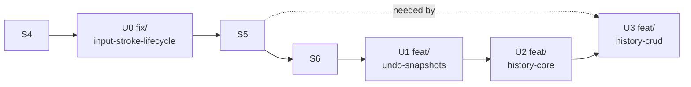

# Undo/Redo — Implementation Order

Companion to [`undo-redo.md`](./undo-redo.md) (the design). This is the build
order: a linear stack of stages, each leaving the tree testable on its own, each
landing in one jj revision with a bookmark. Section refs (§) point into
`undo-redo.md`. Stacks on top of the existing S-ladder in
[`multi-artboard-implementation.md`](./multi-artboard-implementation.md).

## Start here (handoff)

### Progress checklist

- [ ] **U0** — `fix/input-stroke-lifecycle` — synchronous stroke lifecycle + Esc-funnel + drag-commit (§0, §2.1)
- [ ] **U1** — `feat/undo-snapshots` — GPU snapshot pool + restore GpuOps (§3)
- [ ] **U2** — `feat/history-core` — History resource, entries, recording, undo/redo events (§1, §4, §5)
- [ ] **U3** — `feat/history-crud` — add/delete layer/artboard entries (§6), **depends on S5**

Tick a box only when the stage's independent test passes **and** its bookmark
lands. Mirror unchecked stages into the task tracker; exactly one `in_progress`.

- **Read the design first.** `undo-redo.md` has the structs, the redo rule, the
  snapshot mechanics, the risks. This doc is only the order.
- **Placement in the overall stack:** `S4 → U0 → S5 → S6 → U1 → U2 → U3`. U0
  lands immediately on S4 (it's a correctness fix); U1/U2 stack after S6; U3
  needs the S5 panel. U0's two _pure_ findings (defects 1 & 2) may instead be
  squashed into S4 — the Esc-funnel and drag-commit parts are undo/redo
  groundwork and stay in U0 regardless.
- **Line numbers drift** — anchor by symbol name (`InputSystem::process_event`,
  `DragTracker`, `merge_stroke_into_layer`).
- **Pseudocode is illustrative** — verify wgpu/winit signatures against the real
  APIs.

### Build / test / run

| Purpose      | Command                                       |
| ------------ | --------------------------------------------- |
| Native run   | `cargo run`                                   |
| Unit tests   | `cargo test -p crayon --lib -p batteries`     |
| Lint         | `cargo clippy`                                |
| Native build | `cargo build`                                 |
| wasm compile | `cargo build --target wasm32-unknown-unknown` |

Green at every stage boundary — `cargo test`, `cargo clippy`, and both build
targets are exit criteria for every stage, not just the last.

## Principles

- One stage = one jj revision = one bookmark, stacked linearly.
- Every stage independently verifiable before the next begins.
- The build never breaks; no runtime regression windows in this plan.
- Bottom-up: input fix → GPU machinery → history logic → CRUD.

## Stage → bookmark map

| Stage | Bookmark                     | Builds (design §) | Independent test                                                                 |
| ----- | ---------------------------- | ----------------- | -------------------------------------------------------------------------------- |
| U0    | `fix/input-stroke-lifecycle` | §0, §2.1          | Fast-tap emits no stray paint; Esc routes as `PopSelection`; drag → one commit   |
| U1    | `feat/undo-snapshots`        | §3                | Headless snapshot→paint→restore pixel round-trip                                 |
| U2    | `feat/history-core`          | §1, §4, §5        | Both worked examples as unit tests; manual Cmd+Z/redo on strokes/moves/selection |
| U3    | `feat/history-crud`          | §6 (CRUD)         | Delete layer → undo restores it + pixels; add → undo removes, redo re-adds       |



## jj workflow

```sh
jj new -m "U0: synchronous stroke lifecycle + Esc funnel + drag commit"
# ...implement... then once the stage's test passes:
jj bookmark create fix/input-stroke-lifecycle
jj new -m "U1: undo snapshot pool"
```

Keep stages append-only (fix an earlier stage with `jj new` on top or `jj squash`
into it, not by reordering). `jj status` before each stage.

---

# U0 — `fix/input-stroke-lifecycle`

**Builds** (§0, §2.1): make the stroke boundary synchronous and route the two
remaining selection/drag signals through the funnel — the shared prerequisite
for all history recording.

- `resources/input_system.rs`: add `pointer_down`, `drawing`, and the hoisted
  `point_processor` + `brush_position`; emit `StrokeStart`/`BrushPoint`/`StrokeEnd`
  centrally, gated on `pointer_down` (§0.2). Remove `stroke_active` from
  `DispatchEnv`.
- `input/{layer,artboard,global}_handler.rs`: handlers return the stroke-start
  **signal** instead of emitting stroke events; **delete the Global Esc
  safety-net** `StrokeEnd`. Layer/Artboard PointerDown-inside → `Start`.
- `input/dispatch.rs`: `DragTracker` accumulates `total`; add the `Response` /
  `StrokeSignal` return shape.
- `events.rs`/`event_sender.rs`: add `PopSelection`, `CommitMoveLayer`,
  `CommitMoveArtboard` (via the existing `From` relay). `app.rs`: Esc reads
  selection depth and sends `PopSelection` or exits (§0.3); `CommitMove*` arms are
  no-op-mutation stubs here (recorder wired in U2).

**Depends on:** S4.

**Independent test:**

- Event-capture unit tests (harness `T`): fast tap → exactly one `StrokeStart`
  then one `StrokeEnd`; a button-up `PointerMove` after → no `BrushPoint`; Esc
  mid-drag → stroke still ends on `PointerUp`, next stroke's processor is clear.
- Unit test: multi-step Cmd+drag → one `CommitMoveLayer` with summed
  `total_delta`.
- `cargo run` regression: draw / Cmd+drag move / Cmd+drag pan / Cmd+scroll zoom /
  Cmd+R / Esc-pop-then-exit all behave as before; **fast repeated taps leave no
  stray paint** (defect 1 gone).

**Done when:** stroke boundaries are synchronous, Esc and drag-end are funnel
events, and the input regression + new pairing tests pass.

---

# U1 — `feat/undo-snapshots`

**Builds** (§3): GPU snapshot pool and restore ops — no user-facing behavior.

- `resources/scene_renderer.rs`: `snapshots: HashMap<SnapshotId, CRTexture>`;
  `snapshot_layer`, `restore_layer` (both `copy_texture_to_texture`),
  `free_snapshot`. Snapshot textures are artboard-sized, layer format.
- `resources/document_state.rs`: `GpuOp::RestoreLayer`, `GpuOp::FreeSnapshot`;
  `SnapshotId` newtype.
- `systems/paint_system.rs`: handle the new ops in the `gpu_dirty` drain.

**Depends on:** U0 (stacks after S6; needs S3's merge machinery, present).

**Independent test:** headless GPU (harness `T`) — create a layer, paint pattern
A, `snapshot_layer` → id, paint pattern B, apply `RestoreLayer(id)`, `readback_rgba`
→ pixels equal pattern A. `free_snapshot` drops the texture.

**Done when:** snapshot→restore round-trips exactly at the pixel level headless.

---

# U2 — `feat/history-core`

**Builds** (§1, §4, §5): the history logic and its wiring for strokes, moves,
clears, and selection.

- `resources/history.rs`: `History`, `Entry`, `Op`, `Class`, `SelectionSnapshot`;
  `record_content`, `record_selection` (the §1.3 rule), `undo`, `redo`,
  `depth_cap` eviction. Pure, heavily unit-tested.
- Recording taps (§4): selection arms in `app.rs` call `record_selection`;
  `CommitMove*` arms call `record_content`; `PaintSystem` records the stroke entry
  at merge (taking the before-snapshot via U1) and takes `write::<History>`;
  the `ClearLayer` path records with its snapshot.
- Undo/redo events: `ControllerEvent::Undo`/`Redo`; `GlobalContextHandler` emits
  them on Cmd+Z / Cmd+Shift+Z; `user_event` arms apply the inverse (§1.2),
  pushing `RestoreLayer` ops and/or mutating `DocumentState`. Guard: no-op while
  `pointer_down` (§6).

**Depends on:** U1, U0.

**Independent test:**

- Unit tests encode **both worked examples** (§7) plus redo-clear-on-content,
  depth-cap eviction, selection-snapshot sanitization.
- Snapshot-integration test: record a stroke entry, undo → `readback` shows
  pre-stroke pixels; redo → post-stroke pixels.
- `cargo run` manual matrix §7 items 1–6.

**Done when:** both examples pass as tests, and Cmd+Z/Cmd+Shift+Z reverse and
replay strokes, moves, clears, and selection on native.

---

# U3 — `feat/history-crud`

**Builds** (§6 CRUD): add/delete layer/artboard entries.

- Extend `Op` with `AddLayer`/`DeleteLayer`/`AddArtboard`/`DeleteArtboard`;
  delete captures a pre-delete snapshot and the stack index; add retains the
  created GPU texture for redo.
- Wire the S5 CRUD events into `record_content`; undo re-inserts at the original
  index and restores pixels; redo removes/re-adds.

**Depends on:** U2 **and S5** (the panel that issues CRUD; without it, drive via
temporary keybindings).

**Independent test:** delete a painted layer → Cmd+Z restores it at its original
stack position with pixels intact; add a layer → Cmd+Z removes it, Cmd+Shift+Z
re-adds; interleave with stroke undo without corrupting the stacks.

**Done when:** CRUD is fully reversible and the combined undo history (CRUD +
strokes + moves + selection) round-trips without panics.
