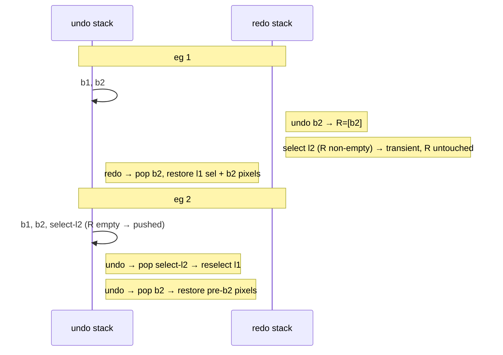
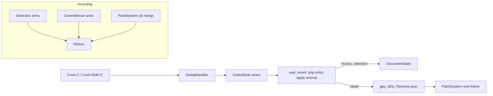

# Undo / Redo (and the S4 stroke-lifecycle fix)

## Context

S4 (`feat/selection-input`) landed the selection stack and bubble dispatch. Two
defects shipped with it, and the event architecture is now the right shape to
carry an undo/redo history — but only once those defects are fixed and a few
gaps are closed.

This document specifies:

- **§0 — the S4 stroke-lifecycle fix**: strokes currently start/stop by round-
  tripping a flag through the async event queue, which under a fast tap leaves a
  stroke "active" with the mouse button up (hover paints), and the brush point
  processor survives the Esc safety-net path (next stroke inherits stale spline
  state). Both are fixed by making the pointer-button and stroke lifecycle
  **synchronous state owned by `InputSystem`**.
- **§1–§6 — undo/redo**: a two-stack history where content actions (strokes,
  moves, clears) are hard entries and **selection changes are soft entries** that
  do not clear the redo stack while a content redo is pending (Figma semantics,
  confirmed with the user). Raster actions are reversed by **GPU texture
  snapshots**, not replay.

Both halves share one mechanism — a single, synchronous stroke boundary — which
is why the fix and the feature are planned together.

### Confirmed decisions

- **Stroke lifecycle is hoisted into `InputSystem`** (synchronous button state),
  replacing the async `stroke_active` round-trip and the per-handler Esc safety
  net.
- **v1 covers** strokes, `MoveLayer`/`MoveArtboard`, `ClearLayer`, and selection.
  **CRUD (add/delete layer/artboard) is deferred** to the history-crud stage,
  which depends on the S5 panel.
- **Raster undo is snapshot-based**, not replay-based (see §3 rationale). Stroke
  replay from events is therefore explicitly _not_ needed.
- **Selection is in the history** and follows the redo-preservation rule in §1.3.

### The two worked examples this design must satisfy

| eg 1 (redo preserves through a selection change)                                                   | eg 2 (selection is undoable)                                                                  |
| -------------------------------------------------------------------------------------------------- | --------------------------------------------------------------------------------------------- |
| select l1; stroke b1; stroke b2; **undo b2**; **select l2**; **redo → restores l1 selection + b2** | select l1; stroke b1; stroke b2; **select l2**; **undo → reselects l1**; **undo → undoes b2** |

## Verified baseline (what the design builds on)

| Fact                                                                                                                  | Where                                               |
| --------------------------------------------------------------------------------------------------------------------- | --------------------------------------------------- |
| Single event funnel: `ControllerEvent → CustomEvent → App::user_event`; the indirection exists "to build undo/redo"   | `event_sender.rs`, `events.rs`, `app.rs` user_event |
| Layer textures carry `COPY_SRC \| COPY_DST \| RENDER_ATTACHMENT` — GPU↔GPU snapshot/restore is legal both ways        | `texture.rs:29-32`                                  |
| Merge already does `copy_texture_to_texture(merge_scratch → layer)`                                                   | `scene_renderer.rs:634`, `merge_stroke_into_layer`  |
| `GpuOp` has only `ClearLayer` today; `PaintSystem` drains `gpu_dirty` first, before any pass                          | `document_state.rs`, `paint_system.rs:46-53`        |
| `StrokeState.target` pinned at `StrokeStart`, consumed by merge; stale-target-immune                                  | `stroke_state.rs`, `paint_system.rs:110-127`        |
| Layer-local paint transform is `world - artboard.position - layer.offset`, camera snapshot per point                  | `paint_system.rs:75-91`                             |
| Esc is handled in `app.rs` _outside_ the dispatcher (needs the event loop to exit); it pops selection directly        | `app.rs` user_event `KeyCode::Escape` arm           |
| Move handlers emit per-mouse-move micro-deltas; `DragTracker` knows begin/step/end but emits no boundary              | `input/dispatch.rs` `DragTracker`, the 3 handlers   |
| `stroke_active` in `DispatchEnv` is sourced from `StrokeState.active_target()` — an async round-trip                  | `app.rs` DispatchEnv build, `layer_handler.rs`      |
| Point processor + `brush_position` live in `LayerContextHandler`; cleared only on its own PointerUp, not the Esc path | `layer_handler.rs`                                  |
| Headless GPU + `readback_rgba` + event capture harness exists                                                         | `testing/gpu.rs`, `testing/events.rs` (rev `T`)     |

---

# 0. The S4 stroke-lifecycle fix

## 0.1 The two defects

1. **`stroke_active` is async.** `layer_handler.rs` gates `PointerMove` drawing
   and `PointerUp` commit on `env.stroke_active`, which is read from
   `StrokeState` — set only after `StrokeStart` round-trips mpsc → forwarder
   thread → event-loop proxy → `user_event`. A fast tap (down-up before
   `StrokeStart` lands) leaves the stroke unterminated: no handler sends
   `StrokeEnd` on that `PointerUp`, then `StrokeStart` lands, and subsequent
   button-**up** `CursorMoved` events satisfy `stroke_active` and paint.
2. **Point processor leaks across the Esc safety net.** When Esc pops the layer
   frame mid-drag, `GlobalContextHandler` sends `StrokeEnd` on `PointerUp`, but
   the `PointProcessor` and `brush_position` live in `LayerContextHandler` and
   are cleared only in _its_ `PointerUp` path. The next stroke inherits the
   previous stroke's Catmull-Rom window and stale tail position.

## 0.2 Fix: hoist the stroke lifecycle into `InputSystem`

Both defects have one root cause — stroke lifecycle state is split across
handlers and partly lives on the far side of the event queue. Consolidate it:

```rust
// illustrative — verify field/borrow details at implementation time
pub struct InputSystem {
    modifiers: ModifiersState,
    cursor: Point2<f32>,
    pointer_down: bool,            // NEW: synchronous, from MouseInput Left
    drawing: bool,                 // NEW: a stroke gesture is in progress
    point_processor: PointProcessor, // MOVED here from LayerContextHandler
    brush_position: Point2<f32>,     // MOVED here
    layer_handler: LayerContextHandler,
    artboard_handler: ArtboardContextHandler,
    global_handler: GlobalContextHandler,
}
```

Handlers no longer emit `StrokeStart`/`BrushPoint`/`StrokeEnd` themselves. They
only **decide** whether a pointer-down should begin a stroke, and return that
decision; `InputSystem` owns the emission, paired to the real button state.

```rust
// illustrative: the handler return grows a stroke-lifecycle signal
pub struct Response { pub handled: Handled, pub stroke: StrokeSignal }
pub enum StrokeSignal { None, Start }   // End is derived by InputSystem on PointerUp
```

- **Layer ctx**, PointerDown inside own artboard, no Cmd → `Response { Yes, Start }`.
- **Artboard ctx**, PointerDown inside, no Cmd → send `SelectLayer(top)`, return
  `Response { Yes, Start }` (select-and-draw; the stroke target is resolved by
  `StrokeState` from the pinned selection as today).
- **Global/Layer/Artboard**, Cmd+drag / scroll / etc. → `Response { .., None }`.

`InputSystem` dispatch, per normalized action:

```text
PointerDown:  pointer_down = true
              dispatch → if any handler returns Start and !drawing:
                  drawing = true; send StrokeStart
PointerMove:  dispatch (Cmd+drag moves still claimed by handlers)
              if drawing && pointer_down && no handler claimed a move-drag:
                  feed point_processor(screen), send BrushPoint(s)
PointerUp:    pointer_down = false
              dispatch (lets a move-drag end)
              if drawing:
                  flush point_processor tail (is_last), send StrokeEnd,
                  point_processor.clear(), drawing = false
```

Consequences:

- **Defect 1 gone:** `StrokeStart`/`StrokeEnd` are both driven by the same
  synchronous `pointer_down` edges. A fast tap emits `StrokeStart` then
  `StrokeEnd` in order; no button-up painting is possible because point emission
  is gated on `pointer_down`.
- **Defect 2 gone:** the processor lives in one place and is cleared on _every_
  stroke end, including when the layer frame was popped by Esc mid-drag.
- **The Global Esc safety net is deleted** — `InputSystem` terminates the stroke
  on `PointerUp` regardless of which selection frame is current. The stroke still
  merges into its pinned `StrokeState.target`.
- **`stroke_active` is removed from `DispatchEnv`.** The renderer's live-stroke
  quad keeps reading `StrokeState.active_target()` (a rendering concern where a
  one-frame async lag is invisible); only _input_ decisions switch to the
  synchronous flag.

**Rationale / trade-off:** this dilutes the "each handler owns its machinery"
purity of S4 — the layer handler no longer owns the point processor. The gain is
a single synchronous stroke boundary that is (a) correct under races and (b) the
exact tap point undo/redo records against (§4). Since only one stroke is ever
active, one owner is the honest model. The minimal-patch alternative (keep
per-handler machinery, add `pointer_down`, clear the processor in the Esc path)
was rejected: it leaves the lifecycle split and the async round-trip partly
load-bearing, and gives history two places to hook instead of one.

## 0.3 Esc through the funnel (undo/redo prerequisite)

Esc currently pops `DocumentState.selection` directly in `app.rs` (it needs the
result to decide app-exit), so a history recorder at the funnel never sees the
selection change. Fix: read the stack depth synchronously to make the exit
decision, but route the pop itself as a `ControllerEvent::PopSelection` so it
flows through the funnel like every other selection change.

```text
Esc pressed:
  depth = read DocumentState.selection depth   // synchronous read
  if depth > 1 { send ControllerEvent::PopSelection }   // recorded in §4
  else         { event_loop.exit() }
```

`PopSelection`'s `user_event` arm calls `selection.pop()`. This makes _every_
selection mutation (`SelectArtboard`, `SelectLayer`, `ClearSelection`,
`PopSelection`) a funnel event — the invariant §4 recording depends on.

---

# 1. History model

## 1.1 Two stacks, one entry type

```rust
// illustrative
pub struct History {
    undo: Vec<Entry>,
    redo: Vec<Entry>,
    depth_cap: usize,        // evict oldest undo entries beyond this (§6)
}

pub struct Entry {
    pub op: Op,
    pub selection_before: SelectionSnapshot, // restored on undo
    pub selection_after:  SelectionSnapshot, // restored on redo
    pub class: Class,        // Content | Selection (drives the redo rule §1.3)
}

pub enum Op {
    Stroke     { layer: LayerId, before: SnapshotId, after: Option<SnapshotId> }, // §3
    ClearLayer { layer: LayerId, before: SnapshotId },
    MoveLayer  { layer: LayerId, delta: Vector2<f32> },
    MoveArtboard { artboard: ArtboardId, delta: Vector2<f32> },
    Selection, // pure context change; before/after carry the stacks
    // deferred to the history-crud stage:
    // AddLayer/DeleteLayer/AddArtboard/DeleteArtboard { snapshot for delete }
}

pub type SelectionSnapshot = Vec<SelectionCtx>; // clone of SelectionStack (≤3 elems, cheap)
```

`SnapshotId` is a handle into a GPU snapshot pool (§3). `SelectionSnapshot` is
just a clone of the stack — three `Copy` enums at most.

## 1.2 Applying an entry (undo / redo are symmetric)

```text
undo(entry):
    if entry.op is raster (Stroke/ClearLayer):
        if entry.op.after is None: entry.op.after = snapshot(layer)  // lazy, §3.3
        push GpuOp::RestoreLayer { layer, snapshot: entry.op.before }
    if entry.op is MoveLayer/MoveArtboard:
        apply -delta to document
    set live selection = entry.selection_before
    push entry onto redo

redo(entry):
    if entry.op is raster:
        push GpuOp::RestoreLayer { layer, snapshot: entry.op.after }   // after exists post-undo
    if entry.op is MoveLayer/MoveArtboard:
        apply +delta to document
    set live selection = entry.selection_after
    push entry onto undo
```

For a **Content** entry, `selection_before == selection_after` (a stroke does not
change selection), so redo "restores l1 selection **and** b2" falls straight out:
the entry recorded under l1 restores l1 then reapplies the after-pixels. For a
**Selection** entry, the two snapshots differ (l1 → l2), giving eg 2's "undo
reselects l1."

## 1.3 The redo-preservation rule (the Figma nuance)

When an action is performed **interactively** (not via undo/redo):

| Action class                  | Effect on the stacks                                                                       |
| ----------------------------- | ------------------------------------------------------------------------------------------ |
| **Content**                   | push entry onto undo; **clear redo** (`selection_before = selection_after = current`).     |
| **Selection**, redo empty     | push a Selection entry (`before = old`, `after = new`); redo already empty.                |
| **Selection**, redo non-empty | **do not push, do not clear redo** — just set live selection = new (transient navigation). |

This is the whole rule, and it produces both examples exactly:



**Rationale:** selection changes made while a content redo is pending are the
user _navigating to look at the redo result_, not authoring a new branch —
Figma treats them as free. Recording them as hard entries (clearing redo) would
destroy the redo the user is about to invoke, breaking eg 1. Recording them as a
distinct soft class, only materialized when the tip is clean, satisfies both.

**Edge:** if, after a transient selection change (eg 1, now on l2, R=[b2]), the
user performs a **Content** action instead of redo, that content push clears redo
(b2 is discarded) — standard branch-discard behavior, expected.

---

# 2. Making actions reversible (closing the gaps)

| Gap                                     | Status in this design                                                                                 |
| --------------------------------------- | ----------------------------------------------------------------------------------------------------- |
| Esc bypasses the funnel                 | **Fixed in §0.3** — routed as `PopSelection`.                                                         |
| Stroke boundaries unreliable            | **Fixed in §0.2** — synchronous `StrokeStart`/`StrokeEnd`.                                            |
| Strokes not replayable from events      | **Not needed** — raster undo restores snapshots, never replays strokes (§3). Explicitly out of scope. |
| Destructive ops capture no before-state | **Solved by §3** — GPU snapshot before every raster mutation.                                         |
| Drags have no boundaries                | **Fixed in §2.1** — a drag commits as one entry.                                                      |

## 2.1 Drag coalescing → one entry per drag

`DragTracker` gains a running `total: Vector2<f32>` (summed steps). Live
`MoveLayer`/`MoveArtboard` micro-delta events still fire on each move for
immediate visual feedback and still mutate the document. On `PointerUp`, if a
drag was active, the handler emits a **history-only** commit:

```rust
ControllerEvent::CommitMoveLayer   { layer: LayerId,     total_delta: Vector2<f32> }
ControllerEvent::CommitMoveArtboard{ artboard: ArtboardId, total_delta: Vector2<f32> }
```

Its `user_event` arm does **not** re-apply the delta (the live events already
did) — it exists solely for the recorder (§4), which turns it into one
`MoveLayer`/`MoveArtboard` entry. Undo negates `total_delta`; redo re-applies it.
A zero-total drag (click without movement) emits no commit.

**Rationale:** recording raw micro-deltas would make undo revert one pixel at a
time. Coalescing in the emitter (which already accumulates via `DragTracker`) is
cheaper and more robust than teaching the recorder to fuse an event stream.

---

# 3. GPU snapshot machinery (raster reversal)

## 3.1 Why snapshots, not replay

Undoing a stroke or clear means restoring the layer's prior pixels. Two options:
**replay** the layer's whole stroke history forward to rebuild state (cost grows
with history; needs world-space replayable events — the dropped gap), or
**snapshot** the affected pixels before mutating and copy them back on undo.
Snapshots win here: layer textures already have `COPY_SRC`/`COPY_DST`
(`texture.rs:29-32`), so a snapshot is one GPU→GPU `copy_texture_to_texture` with
no readback, and undo is symmetric and O(1) in history length. The cost is
memory, bounded in §6.

## 3.2 Pool + ops

`SceneRenderer` owns the pool (it owns all GPU textures):

```rust
// illustrative
pub snapshots: HashMap<SnapshotId, CRTexture>,   // artboard-sized (v1), same format as layers
pub fn snapshot_layer(&mut self, dev, id: LayerId) -> SnapshotId;      // copy layer → new snapshot tex
pub fn restore_layer(&mut self, encoder, snapshot: SnapshotId, layer: LayerId); // copy snapshot → layer
pub fn free_snapshot(&mut self, snapshot: SnapshotId);
```

New `GpuOp` variants, drained by `PaintSystem` before any pass (same discipline
as `ClearLayer`):

```rust
GpuOp::RestoreLayer { layer: LayerId, snapshot: SnapshotId }
GpuOp::FreeSnapshot { snapshot: SnapshotId }
```

`copy_texture_to_texture` legality (already relied on by the merge): identical
format, exact size, destination not sampled in the same pass — all hold for
layer↔snapshot.

## 3.3 When snapshots are taken

- **Stroke:** the layer is untouched until the merge, so `PaintSystem` takes the
  **before** snapshot right before `merge_stroke_into_layer`, on stroke end. It
  records the entry then (§4). `after` is left `None`.
- **ClearLayer:** snapshot in the `ClearLayer` `GpuOp`/event path before the
  clear pass.
- **`after` is captured lazily on first undo** (§1.2): the layer's _current_
  pixels at undo time _are_ the after-state. This halves snapshot storage for
  the common case (entries never undone) and avoids double-snapshotting every
  stroke.

## 3.4 v1 granularity: full layer

v1 snapshots the **whole artboard-sized layer** per raster entry. Simple and
correct. Memory is bounded by the depth cap (§6). **Follow-up (out of scope):**
snapshot only the stroke's dirty AABB (`PaintSystem` accumulates it; the tiling
sketch in `multi-artboard.md` §2.9 already contemplates a per-stroke dirty rect),
cutting memory to painted area — important before large/many artboards on wasm.

---

# 4. Recording & dispatch integration

A `History` resource holds the two stacks and the depth cap. Recording taps the
**funnel**, in one place per action class:

- **Selection events** (`SelectArtboard`/`SelectLayer`/`ClearSelection`/`PopSelection`):
  their `user_event` arms, _after_ mutating `selection`, call
  `history.record_selection(before, after)` which applies the §1.3 rule (push
  iff redo empty; never clear redo).
- **CommitMove\*** events: their arms call `history.record_content(Op::Move…)`
  (clears redo).
- **Strokes:** recorded in `PaintSystem` at merge, where the snapshot is taken —
  `history.record_content(Op::Stroke { layer, before, after: None })`. `PaintSystem`
  already holds `write::<DocumentState>`; it additionally takes `write::<History>`.
- **ClearLayer:** recorded where the clear op is issued, with its before-snapshot.

Undo/redo are themselves events, so they too flow through the funnel:

```rust
ControllerEvent::Undo   // Cmd+Z
ControllerEvent::Redo   // Cmd+Shift+Z
```

Emitted by `GlobalContextHandler` on the matching `Key` actions (macOS: Cmd+Z /
Cmd+Shift+Z; the app is already super-key oriented). Their `user_event` arms pop
from `History` and apply the inverse per §1.2 — mutating `DocumentState`
(moves/selection) and/or pushing `GpuOp::RestoreLayer` (raster) that `PaintSystem`
applies next frame.



**Lock discipline (multi-artboard §6):** `History` is written by `PaintSystem`
(alongside `DocumentState`) and by `user_event` arms; never by a UI widget. No
new cross-system lock ordering beyond `PaintSystem` acquiring `History` in the
same block as its existing `DocumentState`/`SceneRenderer` writes.

---

# 5. Entry boundaries (what is "one" undo)

| Interaction                  | One entry =                                                  |
| ---------------------------- | ------------------------------------------------------------ |
| Brush stroke                 | `StrokeStart … StrokeEnd` (§0.2 pairs these synchronously)   |
| Move layer / artboard drag   | `PointerDown … PointerUp` coalesced via `CommitMove*` (§2.1) |
| Clear layer (Cmd+R / button) | the single `ClearLayer`                                      |
| Selection change             | one `Select*`/`PopSelection`, per the §1.3 rule              |
| CRUD (deferred)              | one add/delete                                               |

---

# 6. Risks & tricky spots

- **Snapshot memory.** Full-layer v1: an 800×600 layer ≈ 1.9 MB, a 2048² layer
  ≈ 16 MB, per raster entry (×2 once undone). Bound with `depth_cap` (default
  proposed **32**); evicting the oldest undo entry frees its snapshots
  (`GpuOp::FreeSnapshot`) — that entry becomes non-undoable. On wasm the 2048
  clamp makes a deep raster history expensive; the dirty-AABB follow-up (§3.4)
  is the real fix. Flag the cap value for tuning.
- **Undo mid-stroke.** Disallow `Undo`/`Redo` while `pointer_down` (a stroke or
  drag is in flight) — the global handler drops them, or `user_event` no-ops
  when a stroke is active. Prevents restoring a layer under a live merge.
- **Async ordering.** Undo/redo cross the same funnel as strokes; because §0.2
  guarantees a stroke is fully `StrokeStart…StrokeEnd`-paired and recorded at
  merge (in `PaintSystem`, on the render thread), an `Undo` event queued after a
  `StrokeEnd` is processed after the stroke's entry exists. The mid-stroke guard
  above covers the un-committed window.
- **Selection snapshot validity.** An entry's `SelectionSnapshot` may reference a
  layer/artboard deleted after the entry was recorded (once CRUD lands). On
  restore, sanitize against the live document (drop dangling frames, same logic
  as `SelectionStack::on_*_deleted`) rather than asserting.
- **`ClearSelection` vs redo.** `ClearSelection` is a Selection-class action, so
  under the §1.3 rule it is transient while a content redo is pending — clicking
  empty canvas won't nuke a pending redo. Intended.
- **CRUD dependency.** Delete-undo needs a pre-delete snapshot and re-insertion
  at the original stack index; add-undo must retain the created GPU texture for
  redo. Designed but **gated on S5** (the panel that issues CRUD) — the
  history-crud stage.
- **Renderer live-stroke lag.** The live-stroke quad still reads the async
  `StrokeState.active_target()`; a one-frame lag there is invisible and
  intentionally not changed.

---

# 7. Verification

**Automated (`cargo test -p crayon --lib`):**

- **History policy (pure, no GPU)** — encode both worked examples as tests:
  - eg 1: after `undo b2`, a `Selection` change with non-empty redo leaves redo
    intact; `redo` restores selection l1 and re-emits the b2 restore op.
  - eg 2: a `Selection` change with empty redo is pushed; `undo` reselects l1;
    second `undo` reverts b2.
  - Content push clears redo; `depth_cap` eviction frees the oldest snapshots.
  - Selection-snapshot sanitization drops dangling frames.
- **§0 stroke lifecycle (event capture, harness `T`)** — fast tap (`PointerDown`
  then `PointerUp`, no `StrokeStart` yet) yields exactly one `StrokeStart` then
  one `StrokeEnd`, and a subsequent button-up `PointerMove` emits no
  `BrushPoint`; Esc mid-drag still ends the stroke on `PointerUp` and the next
  stroke starts with a cleared processor.
- **Snapshot round-trip (headless GPU + `readback_rgba`)** — paint a layer,
  snapshot, paint again, `RestoreLayer(before)` → pixels equal the pre-second-
  paint state; `ClearLayer` then restore → original content returns.
- **Drag coalescing** — a multi-step Cmd+drag emits N live `MoveLayer` + one
  `CommitMoveLayer` whose `total_delta` equals the sum; undo returns `offset` to
  its start.

**Manual, native (`cargo run`):**

1. Draw b1, b2; Cmd+Z reverts b2, again reverts b1; Cmd+Shift+Z redoes each.
2. eg 1 end-to-end: draw b1,b2; undo b2; click another layer; redo → the l1
   layer reselects and b2 reappears.
3. eg 2 end-to-end: draw b1,b2; select another layer; undo → first layer
   reselects; undo → b2 disappears.
4. Cmd+drag a layer, Cmd+Z → it snaps back in one step (not pixel-by-pixel).
5. Cmd+R clear, Cmd+Z → content returns.
6. Fast-tap the canvas repeatedly with the mouse — no stray paint while the
   button is up (regression check for defect 1).
